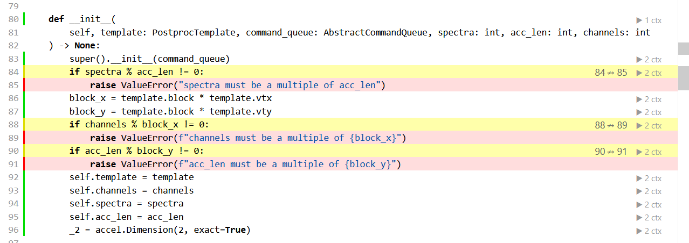
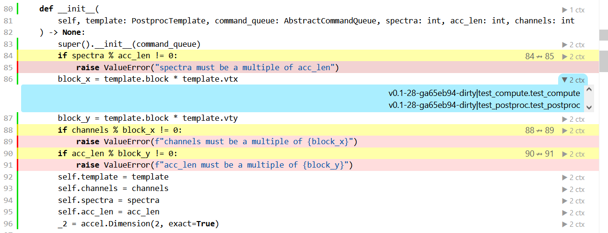

Guidelines for Development
==========================

.. _getting-started:

Getting Started
---------------

First, clone the repo from Github. Don't forget to clone :option:`!--recursive`,
so that the 3rd-party :mod:`.spead2` dependency gets pulled in.

.. code-block:: bash

  git clone --recursive git@github.com:ska-sa/katgpucbf.git

If you do forget the :option:`!--recursive`, then you can pull it in afterwards:

.. code-block:: bash

  cd katgpucbf
  git submodule update --init

A setup script (:program:`dev-setup.sh`) is included for your convenience to
get going.

.. code-block:: bash

  cd katgpucbf
  source dev-setup.sh

The script will perform the following actions:

  - Create a fresh Python virtual environment.
  - Install all the requirements for running, developing and building this
    documentation.
  - Install the :mod:`katgpucbf` package itself, in editable mode.
  - Compile the ``.so`` files needed to run the :mod:`.xbgpu` unit tests.
  - Install :program:`pre-commit` to help with keeping things tidy.

Sourcing the script instead of executing it directly will keep your virtual
environment active, so you can get going straight away. Next time you want to
work, you can just source the virtual environment directly:

.. code-block:: bash

  source .venv/bin/activate

And you are ready to start developing with :mod:`katgpucbf`!

.. tip::

  If you ``source dev-setup.sh`` again, the module will be re-installed in
  editable mode. Usually you probably won't want to do that, but if you do,
  the option is there.

Pre-commit
----------

Pre-commit's `documentation`_ describes what it does in sufficient detail. The
configuration is located in ``.pre-commit-config.yaml``, though the various
other modules which are loaded in this repo will have their configuration in
various places.

.. todo:: Merge the readme from the pre-commit repo into this section?

.. _documentation: https://pre-commit.com/

Unit Testing
------------

Unit testing for this module is performed using :mod:`.pytest` with support from
:mod:`!pytest-asyncio`. Unit test files should follow :mod:`.pytest` conventions.
Additionally, :mod:`.coverage` is used to give the developer insight into what
the unit tests are actually testing, and what code remains untested. Both of
these packages are installed if the ``dev-setup.sh`` script is used as described
in :ref:`getting-started`.

In order to run the tests, use the following command:

.. code-block:: bash

  pytest

:mod:`.pytest` reads its configuration from ``pyproject.toml``. Also installed
as part of this project's ``requirements-dev.txt`` are :mod:`.coverage` and
:mod:`.pytest-cov`. As currently configured, running the unit tests as described
above will execute a subset of the parameterised tests (see the docstring for
``test/conftest.py``), while every combination of parameters won't always be
tested, each individual parameter will be tested at least once.

If you'd like an HTML test-coverage report (at the expense of a slightly longer
time taken to run the test), execute ``pytest`` with the :option:`!--cov` flag.
This report can then be viewed by:

.. code-block:: bash

  xdg-open htmlcov/index.html

Or, if you are developing on a remote server:

.. code-block:: bash

  cd htmlcov && python -m http.server 8089

If you are using VSCode, the editor will prompt you to open the link in a
browser, and automatically forward the port to your ``localhost``. If not, or if
you'd prefer to do it the old-fashioned way, point a browser at port ``8089``
on the machine that you are developing on.

The results will look something like this:

The colour key is at the top of the page, but briefly, lines marked in green
were executed by the tests, red were not. Yellow lines indicate branches which
were only partially covered, i.e. all possible ways to branch were not tested.
In the cases shown, it is because only expected values were passed to the
function in question, the unit tests didn't try to break to test for whether
it would fail.

On the right hand side, a context is shown for the lines that were executed, as
shown in this image:

On the left side of the `|` is the static context - in this case showing
information regarding the git commit that I ran the test on. The right side
shows the dynamic context - in this case, two different tests both executed this
code during the course of their run.

.. note::

  :mod:`.coverage`\'s "dynamic context" output is currently specified by
  :mod:`.pytest-cov` to describe the test function which executed the line of
  code in question. If desired, it can instead be specified in coverage's
  configuration as described in `coverage's documentation`_. This produces a
  slightly different output which conveys more or less similar information.

  .. _coverage's documentation: https://coverage.readthedocs.io/en/stable/contexts.html#dynamic-contexts

  :mod:`.coverage`\'s `static context`_ is more difficult to specify in a way that
  is useful. To generate the report above, I executed the following command:

  .. _static context: https://coverage.readthedocs.io/en/stable/contexts.html#static-contexts

  .. code-block:: bash

    coverage run --context=$(git describe --tags --dirty)

  This gives more useful information about exactly what code was run, and whether
  it's committed or dirty. Unfortunately, doing things this way you miss out on
  the features of :mod:`.pytest-cov`. :mod:`.coverage` supports specifying a
  static context using either the command line (as shown) or via its
  configuration file, including reading of environment variables, but support
  doesn't extend to evaluating arbitrary shell expressions as is possible from
  the command line.

  The package author `suggests`_ the use of a Makefile to generate an environment
  variable which the configuration can then use in generating a static context.
  This strikes me as a good solution, but I am reluctant to include yet another
  boiler-plate file in the repository, so I leave this to the discretion of the
  individual developer to make use of as desired.

  .. tip::

    Although having said that, the Makefile could also replace dev-setup.sh,
    allowing the developer to do something like

    .. code-block:: bash

      made develop  # to set up the environment
      make test     # to actually run the tests

  .. _suggests: https://github.com/nedbat/coveragepy/issues/1190

TODOs
-----

This list is assembled from throughout the documentation. If you're looking for
something to keep yourself busy, this is a good place to start.

.. tip::

  This list only includes TODOs formatted in a way that Sphinx understands.
  There are likely others formatted as comments in Python or C++ throughout the
  code which don't appear listed here. ``grep`` can help you find them!

  The ``test/`` folder is not pulled in by Sphinx, and so any TODOs there will
  also not be included in this list.

.. todolist::
