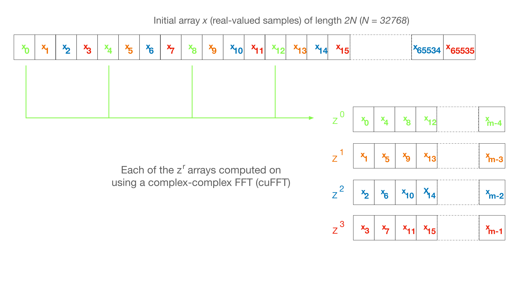

F-Engine Design
===============

Network receive
---------------
Each polarisation is handled as a separate SPEAD stream, with a separate thread.
Separate threads are necessary because a single core is not fast enough to load
the data. This introduces some challenges in aligning the polarisations, because
locking a shared structure on every packet would be prohibitively expensive.
Instead, the polarisations are kept separate during chunking, and aligned
afterwards (in Python). A chunk is buffered until the matching chunk is received
on the other polarisation. Alternatively, if a later chunk is seen for the other
polarisation, then the chunk can never match and is discarded.

To minimise the number of copies, chunks are initialised with CUDA pinned memory
(host memory that can be efficiently copied to the GPU).  Alternatively, it is
possible to use `vkgdr`_ to have the CPU write directly to GPU memory while
assembling the chunk. This is not enabled by default because it is not always
possible to use more than 256 MiB of the GPU memory for this, which can severely
limit the chunk size.

.. _vkgdr: https://github.com/ska-sa/vkgdr

GPU Processing
--------------
The actual GPU kernels are reasonably straight-forward, because they're
generally memory-bound rather than compute-bound. The main challenges are in
data movement through the system.

Narrowband
^^^^^^^^^^
In narrow-band modes, the first step is a down-conversion filter that produces
a new sample stream with a lower bandwidth and sampling rate. The kernel
implementing this is particularly complex, and is discussed separately in
`fgpu.ddc`_.

.. note::

   At the time of writing, the kernel has been written but the full narrowband
   operation is not yet implemented.

Decode
^^^^^^
Digitiser samples are 10-bit and stored compactly. While it is possible to
write a dedicated kernel for decoding that makes efficient accesses to memory
(using contiguous word-size loads), it is faster overall to do the decoding as
part of the PFB filter because it avoids a round trip to memory. For the
PFB, the decode is done in a very simple manner:

 1. Determine the two bytes that hold the sample.
 2. Load them and combine them into a 16-bit value.
 3. Shift left to place the desired 10 bits in the high bits.
 4. Shift right to sign extend.
 5. Convert to float.

While many bytes get loaded twice (because they hold bits from two samples),
the cache is able to prevent this affecting DRAM bandwidth.

The narrowband digital down conversion also decodes the 10-bit samples, but this
is discussed :ref:`separately <ddc-load>`.

Polyphase Filter Bank
^^^^^^^^^^^^^^^^^^^^^
The polyphase filter bank starts with a finite impulse response (FIR) filter,
with some number of *taps* (e.g., 16), and a *step* size which is twice the
number of output channels. This can be thought of as organising the samples as
a 2D array, with *step* columns, and then applying a FIR down each column.
Since the columns are independent, we map each column to a separate workitem,
which keeps a sliding window of samples in its registers. GPUs generally don't
allow indirect indexing of registers, so loop unrolling (by the number of
taps) is used to ensure that the indices are known at compile time.

This might not give enough parallelism, particularly for small channel counts,
so in fact each column in split into sections and a separate workitem is used
for each section. There is a trade-off here as samples at the boundaries
between sections need to be loaded by both workitems, leading to overheads.

Registers are used to hold both the sliding window and the weights, which
leads to significant register pressure. This reduces occupancy and leads to
reduced performance, but it is still good for up to 16 taps. For higher tap
counts it would be necessary to redesign the kernel.

The weights are passed into the kernel as a table, rather than computed on the
fly. While it may be possible to compute weights on the fly, using single
precision in the computation would reduce the accuracy. Instead, we compute
weights once on the host in double precision and then convert them to
single precision.

A single FIR may also need to cross the boundary between chunks. To handle
this, we allocate sufficient space at the end of each chunk for the PFB
footprint, and copy the start of the next chunk to the end of the current one.
Note that this adds an extra chunk worth of latency to the process.

.. _fgpu-fft:

FFT
^^^
After the FIR above, we can perform the FFT, which is done with cuFFT. The
built-in support for doing multiple FFTs at once means that it can saturate
the GPU even with small channel counts.

Naïvely using cuFFT for the full real-to-complex transformation can be quite
slow and require multiple passes over the memory, because

1. There is a maximum number of channels that cuFFT can handle in one pass (it
   depends on the GPU, but seems to be 16384 for a GeForce RTX 3080 Ti).
   Larger transforms require at least one more pass.

2. It appears to handle real-to-complex transforms by first doing a
   complex-to-complex transform and then using an additional pass to fix up
   the result (i.e. form final FFT output).

For performance reasons, we move part of the Fourier Transform into the
post-processing kernel, and also handle fixing up the real-to-complex transformation.
This is achieved by decomposing the transformation into separately-computed smaller parts
(using the Cooley-Tukey algorithm). Part of the Fourier transform is computed using
cuFFT and the final stage (post-processing kernel) of the process includes one round of
Cooley-Tukey computation and the computation to form the real-to-complex transformation.

To start, let's consider the traditional equation for the Fourier Transform. Let :math:`N`
be the number of channels into which we wish to decompose the input sequence, and let
:math:`x_i` be the (real) time-domain samples (:math:`0 \le i < 2N`) and :math:`X_k` be its discrete
Fourier transform (DFT). Because the time domain is real, the frequency domain is Hermitian symmetric,
and we only need to compute half of it to recover all the information. We thus only need to consider
:math:`k` from :math:`0` to :math:`N-1` (this loses information about :math:`X_N`, but it is convenient
to discard it and thus have a power-of-two number of outputs).

.. math:: X_k = \sum_{i=0}^{2N-1} e^{\frac{-2\pi j}{2N}\cdot ik} x_i.

We know that a direct implementation of the DFT is inefficient and alternative, more efficient
means exist to perform this computation. One such method is the FFT introduced by Cooley-Tukey
and in the GPU space cuFFT is one such implementation. As highlighted earlier, transform sizes
of greater than 16384 (for a GeForce RTX 3080 Ti at least) require more than one memory pass making it
less efficient than it needs to be. The technique detailed below uses the decomposition as provided by
Cooley-Tukey to break down a larger transform into smaller 'sub-transforms' where the number of 'sub-transforms'
is intentionally kept small for efficiency reasons and later combined (same process as the FFT) to form
the larger transform size. This is a multi-step process and requires some extra notation and math tricks.

Real-to-complex transform
~~~~~~~~~~~~~~~~~~~~~~~~~
Now for some notation to see how this works. We start by treating :math:`x` (a real array of length 2N) as if it is
a complex array :math:`z` of length N, with each adjacent pair of real values in :math:`x` interpreted as the
real and imaginary components of a complex value, and computing the Fourier transform of :math:`z`. Formally,
let :math:`u_i = x_{2i}` and :math:`v_i = x_{2i+1}`. Then :math:`z_i = u_i + jv_i = x_{2i} + j x_{2i+1}`.

We will start by computing the Fourier transform of :math:`z`. Let :math:`U`, :math:`V` and :math:`Z` denote the
Fourier transforms of :math:`u`, :math:`v` and :math:`z` respectively. Since the Fourier transform is a linear
operator and we defined :math:`z = u + jv`, we also have :math:`Z = U + jV`.

It is important to remember that both :math:`u` and :math:`v` are real-valued, so :math:`U`
and :math:`V` are Hermitian symmetric. By re-arranging things we can reconstruct :math:`U` and
:math:`V` from :math:`Z` using Hermitian symmetry properties. Let :math:`U'`
be :math:`U` with reversed indices i.e., :math:`U'_k = U_{-k}` where indices are taken
modulo :math:`N`.

Hermitian symmetry means that :math:`U'_k = U_{-k} = \overline{U_k}` where
the 'overline' in :math:`\overline{U_k}` denotes conjugation. This is effectively saying that by taking the
reverse indices in :math:`U_k` we get a conjugated result (see [#]_ for a reminder of why this is the case).

Looking back at :math:`U` and :math:`V` components, :math:`U' = \overline{U}` and similarly :math:`V' = \overline{V}`.
Why is this important? Previously we stated that :math:`Z = U + jV`. Now we can consider the reverse of :math:`Z`,
namely :math:`Z'`.

.. math::
   Z'              &= U' + jV'\\
   \overline{Z'}   &= \overline{U' + jV'}\\
                   &= \overline{U'} + \overline{j}\overline{V'}\\
                   &= U - jV\\

What we actually want is to be able to separate out :math:`U` and :math:`jV` in terms of only :math:`Z`
and :math:`Z'` (remember, :math:`z` is the input array of real-valued samples reinterpreted as if it is
an array of N complex samples).

Now let's formulate both :math:`U` and :math:`V` in terms of :math:`Z` and :math:`\overline{Z'}`.

.. math::
      Z + \overline{Z'} &= (U + jV) + (U - jV)\\
                        &= 2U +j(V-V)\\
                        &= 2U.

Likewise,

.. math::
      Z - \overline{Z'} &= (U + jV) - (U - jV)\\
                        &= 2jV.

Using the above we can see that :math:`U = \frac{Z + \overline{Z'}}{2}` and similarly
:math:`V = \frac{Z - \overline{Z'}}{2j}`. Next, we use the Cooley-Tukey
transform to construct :math:`X` from :math:`U` and :math:`V`. To do this let's go back to
the initial definition of the DFT and expand that using the Cooley-Tukey approach.

.. math::

   X_k &= \sum_{i=0}^{2N-1} e^{\frac{-2\pi j}{2N}\cdot ik} x_i\\
       &= \sum_{i=0}^{N-1} e^{\frac{-2\pi j}{2N}\cdot 2ik} u_i +
          \sum_{i=0}^{N-1} e^{\frac{-2\pi j}{2N}\cdot (2i+1)k} v_i\\
       &= \sum_{i=0}^{N-1} e^{\frac{-2\pi j}{N}\cdot ik} u_i +
          e^{\frac{-\pi j}{N}\cdot k}\sum_{i=0}^{N-1} e^{\frac{-2\pi j}{N}\cdot ik} v_i\\
       &= U_k + e^{\frac{-\pi j}{N}\cdot k} V_k.\\

What we get is a means to compute the desired output :math:`X_{k}` using the :math:`U` and :math:`V`
which we compute from the complex-valued input data sequence :math:`z`.

We can also re-use some common expressions by computing :math:`X_{N-k}` at the same time

.. math::

   X_{N-k} &= U_{N-k} + e^{\frac{-\pi j}{N}\cdot (N-k)} V_{N-k}\\
           &= \overline{U_k} - \overline{e^{\frac{-\pi j}{N}\cdot k} V_k}.

This raises the question: Why compute both :math:`X_{k}` and :math:`X_{N-k}`? After all,
parameter :math:`k` should range the full channel range initially stated (parameter :math:`N`). The answer:
compute efficiency. It is costly to compute :math:`U_k` and :math:`V_k` so if we can use them to
compute two elements of :math:`X`` (:math:`X_{k}` and :math:`X_{N-k}`) at once it is better than producing
only one element of :math:`X`.

Why is doing all this work more efficient that letting cuFFT handle the
real-to-complex transformation? After all, cuFFT most likely does this (or
something equivalent) internally. The answer is that instead of using a
separate kernel for it (which would consume memory bandwidth), we built it
into the postprocessing kernel (see the next section).

Unzipping the FFT
~~~~~~~~~~~~~~~~~
Right --- lets get practical and show how we *actually* implement this. From here we'll assume all
transforms are complex-to-complex unless specified otherwise. Firstly, some recap: the Cooley-Tukey
algorithm allows a transform of size :math:`N = mn` to be decomposed into :math:`n` transforms of
size :math:`m` followed by :math:`m` transforms of size :math:`n`. We'll refer to :math:`n` as the
"unzipping factor". We will keep it small (typically not more than 4), as the
implementation requires registers proportional to this factor. We are now going to go step-by-step and
separate the input array :math:`z` into :math:`n` parts of size :math:`m` with each part operated on using a
Fourier transform.

To recap the indexing used in the Cooley-Tukey algorithm: let a
time-domain index :math:`i` be written as :math:`qn + r` and a frequency-domain index :math:`k` be
written as :math:`pm + s`. Let :math:`z^r` denote the array :math:`z_r, z_{n+r}, \dots, z_{(m-1)n+r}`,
and denote its Fourier transform by :math:`Z^r`. It is worthwhile to point out that the superscript
:math:`r` *does not* denote exponentiation but rather is a means to indicate an :math:`r^{th}` array.
In practice this :math:`r^{th}` array is a subset (part) of the larger :math:`z` array of input data.

As a way of an example, let :math:`n=4` ("unzipping factor") and :math:`N=32768` (total number of channels).
Now let's unpack this a bit further --- what is actually happening is that the initial array :math:`z` is divided into
:math:`n=4` separate arrays each of :math:`m=32768/4 = 8192` elements (hence the :math:`N = mn` above).
The actual samples that land up in each array are defined by the indices :math:`i` and :math:`k`.

Lets start with :math:`i`. It was stated that :math:`i = qn + r`. The parameter :math:`r` takes on the range :math:`0` to :math:`n-1`
(so :math:`r=0` to :math:`r=3` as :math:`n = 4`) and :math:`q` takes on the
range :math:`0` to :math:`m-1` (i.e. :math:`q=0` to :math:`q=8191`).
So we are dividing up array :math:`z` into :math:`n` smaller arrays denoted by  :math:`r` (i.e. :math:`z^{r}`)
each of length :math:`m=8192`. So what does this look like practically?

The first array when :math:`r=0` (i.e. :math:`z^{0}`)

========================   ========
   Inputs                  Index
------------------------   --------
  qn + r                      i
========================   ========
:math:`0 \cdot 4` + 0         0
:math:`1 \cdot 4` + 0         4
:math:`2 \cdot 4` + 0         8
...                           ...
...                           ...
:math:`8191 \cdot 4` + 0    32764
========================   ========

This can be extended to the other remaining arrays. The fourth array when :math:`r=3` (for example), :math:`z^{3}`
is :math:`z_{3}`, :math:`z_{7}`, :math:`z_{11}`, ..., :math:`z_{32767}`.

What this shows is that each sub-array consists of samples from the initial array :math:`z` indexed
by :math:`i=qn+r` where each sample is every :math:`4^{th}` and offset by :math:`r`. Pictorially
this looks like,

Right, so we have separate sub-arrays as indexed from the initial array, what happens next? These various
:math:`z^{r}` arrays are fed to cuFFT yielding :math:`n` complex-to-complex transforms. These separate transforms
now need to be combined to form a single real-to-complex transform of the full initial size. An inconvenience
of this structure is that :math:`z^r` is not a contiguous set of input samples, but a strided array.
While cuFFT does support both strided inputs and batched transformations, we cannot batch over :math:`r`
and over multiple spectra at the same time as it only supports a single batch dimension with corresponding
stride. We solve this by modifying the PFB kernel to reorder its output such that each :math:`z^r` is output
contiguously. This can be done by shuffling some bits in the output index (because we assume powers of two
everywhere).

To see how the :math:`k` indexing works :math:`k = pm + s` and is dealt with in a similar manner as above.
Parameter :math:`m = 8192` (in this example), and :math:`p` has a range :math:`0` to :math:`n-1`
(i.e. :math:`p = 0` to :math:`p = 3` as :math:`n = 4` in our example); and :math:`s` takes on the
range :math:`0` to :math:`m-1` (i.e. :math:`s = 0` to :math:`s = 8191`).

Looking at this practically,

When :math:`p = 0`

===========================  =========
   Inputs                     Index
---------------------------  ---------
  pm + s                      k
===========================  =========
:math:`0 \cdot 8192` + 0      0
:math:`0 \cdot 8192` + 1      1
:math:`0 \cdot 8192` + 2      2
...                           ...
...                           ...
:math:`0 \cdot 8192` + 8191   8191
===========================  =========

This too can be extended to the other remaining arrays.

Viewing the above tables it can be seen that the full range of outputs are indexed in batches of
:math:`m = 8192` outputs, *but*, this is not yet the final output and are merely the outputs as provided
by inputting the respective :math:`z^{r}` arrays into cuFFT (all we have done at this point is
computed :math:`Z^{r}` using cuFFT). As a useful flashback, we are aiming to compute :math:`Z_{k}` from :math:`z`
(made up from smaller arrays :math:`z^{r}`) with the intention of computing the :math:`U` and :math:`V`
terms. Why? So that with :math:`U` and :math:`V` we can compute :math:`X_{k}` which is our desired
final output.

The aim is to compute :math:`Z_k` so putting it more formally we have

.. math::

   Z_k = Z_{pm+s}
   &= \sum_{i=0}^{mn - 1} e^{\frac{-2\pi j}{mn}\cdot ik} z_i\\
   &= \sum_{q=0}^{m - 1}\sum_{r=0}^{n-1}
      e^{\frac{-2\pi j}{mn}(qn + r)(pm + s)} z_{qn + r}\\
   &= \sum_{r=0}^{n-1} e^{\frac{-2\pi j}{n}\cdot rp} \left[e^{\frac{-2\pi j}{mn}\cdot rs}
      \sum_{q=0}^{m-1} e^{\frac{-2\pi j}{m}\cdot qs} z^r_q\right]\\
   &= \sum_{r=0}^{n-1} e^{\frac{-2\pi j}{n}\cdot rp}
      \left[e^{\frac{-2\pi j}{mn}\cdot rs} Z^r_s\right].

The whole expression is a Fourier transform of the expression in brackets
(the exponential inside the bracket is the so-called "twiddle factor").

In the post-processing kernel, each work-item computes the results for a
single :math:`s` and for all :math:`p`. To compute the real-to-complex
transformation, it also needs to compute

.. math::

   \overline{Z_{-k}} = \overline{Z_{-pm - s}}
   = \sum_{r=0}^{n-1} e^{\frac{-2\pi j}{n}\cdot rp}
     \left[e^{\frac{-2\pi j}{mn}\cdot rs} \overline{Z^r_{-s}}\right].

Right, lets wrap things up. We have :math:`Z_{k}` (i.e. :math:`Z`)
and :math:`\overline{Z_{-k}}` (i.e. :math:`\overline{Z'}`) which is what we set
out to compute. This then means we can compute :math:`X_{k}` and :math:`X_{N-k}`
as stated earlier from :math:`U = \frac{Z + \overline{Z'}}{2}` and
:math:`V = \frac{Z - \overline{Z'}}{2j}` (with appropriate twiddle factor) to combine
the various outputs from cuFFT and get the final desired output :math:`X_k`.

We also wish to keep a tally of saturated (clipped) values, which requires
that each output value is considered exactly once. This is made more
complicated by the process that computes :math:`X_k` and :math:`X_{N-k}`
jointly. With :math:`k = pm + s`, we consider all :math:`0 \le p < n` and
:math:`0 \le s \le \frac{m}{2}`, and discard :math:`X_{N-k}` when :math:`s =
0` or :math:`s = \frac{m}{2}` as these are duplicated cases.

Postprocessing
^^^^^^^^^^^^^^
The remaining steps are to

 1. Compute the real Fourier transform from several complex-to-complex
    transforms (see the previous section).
 2. Apply gains and fine delays.
 3. Do a partial transpose, so that *spectra-per-heap* (256 by default) spectra
    are stored contiguously for each channel (the Nyquist frequencies are also
    discarded at this point).
 4. Convert to int8.
 5. Interleave the polarisations.

These are all combined into a single kernel to minimise memory traffic. The
katsdpsigproc package provides a template for transpositions, and the other
operations are all straightforward. While C++ doesn't have a convert with
saturation function, we can access the CUDA functionality through inline PTX
assembly (OpenCL C has an equivalent function).

Fine delays and the twiddle factor for the Cooley-Tukey transformation are
computed using the ``sincospi`` function, which saves both a multiplication by
:math:`\pi` and a range reduction.

Coarse delays
^^^^^^^^^^^^^
One of the more challenging aspects of the processing design was the handling
of delays. In the end we chose to exploit the fact that the expected delay
rates are very small, typically leading to at most one coarse delay change per
chunk. We thus break up each chunk into sections where the coarse delay is
constant for both polarisations.

Our approach is based on inverting the delay model: output timestamps are
regularly spaced, and for each output spectrum, determine the sample in the
input that will be delayed until that time (to the nearest sample). We then
take a contiguous range of input samples starting from that point to use in
the PFB. Unlike the MeerKAT FPGA F-engine, this means that every output
spectrum has a common delay for all samples. There will also likely be
differences from the MeerKAT F-engine when there are large discontinuities in
the delay model, as the inversion becomes ambiguous.

The polarisations are allowed to have independent delay models. To accommodate
different coarse delays, the space at the end of each chunk (to which the start
of the following chunk is copied to accommodate the PFB footprint) is expanded,
to ensure that as long as one polarisation's input starts within the chunk
proper, both can be serviced from the extended chunk. This involves a tradeoff
where support for larger differential delays requires more memory and more
bandwidth. The dominant terms of the delay are shared between polarisations,
and the differential delay is expected to be extremely small (tens of
nanoseconds), so this has minimal impact.

The GPU processing is split into a front-end and a back-end: the front-end
consists of just the PFB FIR, while the backend consists of FFT and
post-processing. Because changes in delay affect the ratio of input samples to
output spectra, the front-end and back-end may run at different cadences. We
run the front-end until we've generated enough spectra to fill a back-end
buffer, then run the back-end and push the resulting spectra into a queue for
transmission. It's important to (as far as possible) always run the back-end
on the same amount of data, because cuFFT bakes the number of FFTs into its
plan.

Digitiser sample statistics
^^^^^^^^^^^^^^^^^^^^^^^^^^^
The PFB kernel also computes the average power of the incoming signal. Ideally
that would be done by a separate kernel that processed each incoming sample
exactly once. However, doing so would be expensive in memory bandwidth.
Instead, we update statistics as samples are loaded for PFB calculations.

Some care is needed to avoid double-counting due to overlapping PFB windows.
The simplest way to add this to the existing code is that for each output
spectrum, we include the last 2 × channels samples from the PFB window. In
steady state operation and in the absence of coarse delay changes, this will
count each sample exactly once. Coarse delay changes will cause some samples
to be counted twice or not at all, but these are sufficiently rare that it is
not likely to affect the statistics.

Average power is updated at the granularity of output chunks. The PFB kernel
updates a total power accumulator stored in the output item. This is performed
using (64-bit) integer arithmetic, as this avoids the pitfalls of
floating-point precision when accumulating a large number of samples.

Network transmit
----------------
The current transmit system is quite simple. A single spead2 stream is created,
with one substream per multicast destination. For each output chunk, memory
together with a set of heaps is created in advance. The heaps are carefully
constructed so that they reference numpy arrays (including for the timestamps),
rather than copying data into spead2. This allows heaps to be recycled for new
data without having to create new heap objects.

PeerDirect
^^^^^^^^^^
When GPUDirect RDMA / PeerDirect is used, the mechanism is altered slightly to
eliminate the copy from the GPU to the host:

1. Chunks no longer own their memory. Instead, they use CUDA device pointers
   referencing the memory stored in an OutItem. As a result, Chunks and
   OutItems are tied tightly together (each OutItem holds a reference to the
   corresponding Chunk), instead of existing on separate queues.

2. Instead of OutItems being returned to the free queue once the data has been
   copied to the host, they are only returned after the data they hold has
   been fully transmitted.

3. More OutItems are allocated to compensate for the increased time required
   before an OutItem can be reused. This has not yet been tuned.

There may be opportunities for further optimisation, in the sense of reducing
the amount of memory that is not actively in use, because some parts of an
OutItem can be recycled sooner than others. Since GPUs that support this
feature tend to have large amounts of memory, this is not seen as a priority.

Output Heap Payload Composition
^^^^^^^^^^^^^^^^^^^^^^^^^^^^^^^

In the case of an 8192-channel array with 64 X-engines, each heap contains 8192/64 =
128 channels. By default, there are 256 time samples per channel. Each sample is
dual-pol complex 8-bit data for a combined sample width of 32 bits or 4 bytes.

The heap payload size in this example is equal to

    channels_per_heap * samples_per_channel * complex_sample_size = 128 * 256 * 4 = 131,072 = 128 KiB.

The payload size defaults to a power of 2, so that packet boundaries in a heap
align with channel boundaries. This isn't important for the :mod:`spead2`
receiver used in the X-engine, but it may be useful for potential third party
consumers of F-engine data.

Missing data handling
---------------------
Inevitably some input data will be lost and this needs to be handled. The
approach taken is that any output heap which is affected by data loss is
instead not transmitted. All the processing prior to transmission happens as
normal, just using bogus data (typically whatever was in the chunk from the
previous time it was used), as this is simpler than trying to make vectorised
code skip over the missing data.

To track the missing data, a series of "present" boolean arrays passes down
the pipeline alongside the data. The first such array is populated by spead2.
From there a number of transformations occur:

1. When copying the head of one chain to append it to the tail of the previous
   one, the same is done with the presence flags.
2. A prefix sum (see :func:`numpy.cumsum`) is computed over the flags of the
   chunk. This allows the number of good packets in any interval to be
   computed quickly.
3. For each output spectrum, the corresponding interval of input heaps is
   computed (per polarisation) to determine whether any are missing, to
   produce per-spectrum presence flags.
4. When an output chunk is ready to be sent, the per-spectrum flags are
   reduced to per-frame flags.

.. _fgpu.ddc:

Narrowband down-conversion kernel
---------------------------------

To provide efficient operation on a narrowband region, several logical steps are
performed:

1. The signal is multiplied (:dfn:`mixed`) by a complex tone of the form
   :math:`e^{2\pi jft}`, to effect a shift in the frequency of the
   signal. The centre of the desired band is placed at the DC frequency.

2. The signal is convolved with a low-pass filter. This eliminates the
   unwanted parts of the band, to the extent possible with a FIR filter.

3. The signal is decimated (every Nth sample is retained), reducing the data
   rate. The low-pass filter above limits aliasing.

For efficiency, all three operations are implemented in the same kernel. In
particular, the filtered samples that would be removed by decimation are never
actually computed.

The kernel is one of the more complex in katgpucbf. Simpler implementations
tend to have low performance because the target GPUs (NVIDIA Ampere
architecture, particularly those based on GA-102) have far more throughput for
flops than for the load-store pipeline or local memory (recall that we're
using OpenCL :ref:`gpu-terminology`), and attempts to allievate this can also
easily consume a lot of local memory and thus reduce occupancy.

Work groups
^^^^^^^^^^^
Each work group is responsible for producing a contiguous set of output
samples (given by the constant :c:macro:`GROUP_OUT_SIZE`). To do so, it needs
to load data from :c:macro:`LOAD_SIZE` input samples, which includes the extra
samples needed to cater for the footprint of the low-pass filter.

To maximise the arithmetic intensity and minimise the number of load/store
operations, it's necessary for the kernel to hold a lot of data in registers.
To avoid needing all the data at the same time, it has an outer loop that
alternates between firstly, loading, decoding and mixing some data, and
secondly, applying the low-pass filter. These two stages use different
mappings of work items to work, and communicate through local memory.

.. _ddc-load:

Loading and unpacking
^^^^^^^^^^^^^^^^^^^^^
Initially (prior to the outer loop mentioned above), each work item loads the
packed 10-bit samples for some number of input samples into registers (between
them they load all :c:macro:`LOAD_SIZE` samples). To save space, these are
unpacked only as needed.

To simplify alignment, the input samples are divided
into :dfn:`segments` of 16 consecutive samples, which consumes 20 bytes or
five 32-bit words. The segments are distributed amongst the work items in
round-robin fashion, so that work item :math:`i` holds segments :math:`i + jW`
where :math:`W` is the work group size (:c:macro:`WGS` in the code). There
won't be an equal number of segments for each work item, so some work items
will be holding useless data.

When a sample is required, it is unpacked, given the segment and position
within the segment. The kernel is designed so that the position in the segment
is always a compile-time constant (after loop unrolling), which means the
necessary registers and shift amounts are also known at compile-time.

To cheaply achieve sign extension, the value is first shifted to the top 10
bits of a 32-bit (signed integer), then shifted right. In standard C/C++ this
is undefined behaviour, but CUDA implements the common behaviour of performing
sign extension.

In some cases the desired sample is split across a word boundary. CUDA
provides a (hardware-accelerated) :dfn:`funnel-shift` intrinsic, which allows two
words to be combined into a 64-bit word and shifted, retaining just the high
32 bits of the result; this is ideal for our use case.

Mixer signal
^^^^^^^^^^^^
Care needs to be taken with the precision of the argument to the mixer signal.
Simply evaluating the sine and cosine of :math:`2\pi f t` when
:math:`t` is large can lead to a catastrophic loss of precision, as the
product :math:`f t` will have a large integer part and leave few bits for
the fractional part. Even passing :math:`f` in single precision can lead
to large errors.

To overcome this, a hybrid approach is used. Let the first sample handled by a
work item be :math:`t_0`, and the kth sample of the ith segment be :math:`t_0
+ t_{i,k}`. Note that :math:`t_{i,k}` is the same for all work items.
We can write the mixer value as
:math:`e^{2\pi j f t_0}e^{2\pi j f t_{i,k}}`. The second factor can be
pre-computed for all :math:`i` and :math:`k` and stored in a small lookup
table. The former still needs expensive handling, but needs to be performed
far fewer times. We compute :math:`f t_0` in double precision, subtract
the nearest integer (to increase the number of fractional mantissa bits
available) and then proceed in single precision.

FIR filter
^^^^^^^^^^
For the FIR filter, a different mapping of work items to samples is used.
The work items are partitioned into :dfn:`subgroups` each containing
:c:macro:`SG_SIZE` work items. Each subgroup collaborates to produce
:c:macro:`COARSEN` consecutive output samples.

The position of each work item within its subgroup is stored in
:c:var:`sg_rank`). Each work item is responsible only for samples whose index
modulo :c:macro:`SG_SIZE` equals :c:var:`sg_rank`. It's not entirely clear why
having this division of labour improves performance, although it does reduce
the ratio of (input and output) samples to threads and hence allows for
greater occupancy.

Samples are loaded in an order that processes all input samples with the
same index modulo :c:macro:`DECIMATION` together, keeping a sliding window of
:c:macro:`COARSEN` such samples. This allows each subgroup to load each input
sample from local memory just once, even though each contributes to multiple
output samples. Note that other subgroups will still retrieve some of the
same samples (from local memory), but the coarsening mitigates the cost of
this.

At the end of the kernel, the work items in a subgroup need to sum their
individual results. This is done using a facility of :mod:`katsdpsigproc`,
which in practice utilises warp shuffle instructions. While reasonably
efficient for small values of :c:var:`SG_SIZE`, this rapidly becomes costly as
it increases: the overhead relative to the per-work item accumulation scales
as :math:`O(n\log n)`.

Tiles
^^^^^
Each segment is further subdivided into :dfn:`tiles`. For each tile,
:c:macro:`SG_SIZE` decoded and mixed samples are kept in local memory at a
time; this limitation helps reduce local memory usage. These are written in
the first phase (decoding and mixing), and read in the second phase (FIR
filter), and then the next set of :c:macro:`SG_SIZE` samples are written for
every tile, etc.

The tile size should generally be as large as possible (so that the fraction
of data held in memory is as small as possible), and in the simplest
case, tiles correspond exactly to segments. However, the tile
size must divide into the decimation factor, so when the decimation factor is
smaller than (or not a multiple of) the segment size, tiles must be smaller
than segments.

Uncoalesced access
^^^^^^^^^^^^^^^^^^
Both the global reads and writes use uncoalesced accesses, meaning that
adjacent work items do not read from/write to adjacent addresses. This can
harm performance, and usually it is beneficial to stage copies through local
memory using coalesced accesses. However, attempts to do so have only reduced
performance. It's not clear why, but it may be that there is sufficient
instruction-level parallelism to hide the latency, and the extra work on the
load-store pipeline when using local memory just slows things down.

Performance tuning
^^^^^^^^^^^^^^^^^^
The work group size, subgroup size and coarsening factor can all affect
performance significantly, and not always in obvious ways. It will likely be
necessary to implement autotuning to get optimal results across a range of
problem parameters and hardware devices, but this has not yet been done.

.. rubric:: Footnotes

.. [#]
   Going back to the original definition for the DFT we saw the complex
   exponential :math:`e^{\frac{-2\pi j}{2N}\cdot ik}` has a variable :math:`k`
   where :math:`k` represents the frequency component under computation for the
   input sequence :math:`x_i.` If :math:`k` is reversed (i.e. negative) the
   complex exponential changes to :math:`e^{\frac{2\pi j}{2N}\cdot ik}` as the
   negative in :math:`-k` multiplies out.
