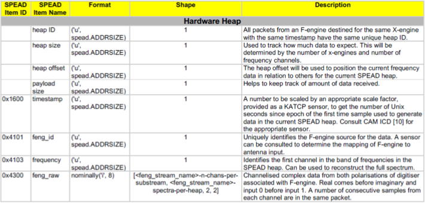

.. _fengine-networking:

F-Engine Networking
===================

.. todo::

    Most of this will need to be worked into the Operation -> Data Interfaces
    section underneath the generic data packet description. There may be some
    leftover information that will need to go into the DSP Engine Design section
    but I think this will likely be minimal.

Input
-----
The F-engine receives dual-polarisation input from a digitiser (raw antenna)
stream. In MeerKAT and MeerKAT Extension, each polarisation's raw digitiser data
is distributed over eight contiguous multicast addresses, to facilitate load-
balancing on the network, but the receiver is flexible enough to accept input
from more or fewer multicast addresses.

The only immediate item in the digitiser's output heap used by the F-engine is
the ``timestamp``.

Output Heap Payload
-------------------

In the case of an 8192-channel array with 64 X-engines, each heap contains 8192/64 =
128 channels. By default, there are 256 time samples per channel. Each sample is
dual-pol complex 8-bit data for a combined sample width of 32 bits or 4 bytes.

The heap payload size in this example is equal to

    channels_per_heap * samples_per_channel * complex_sample_size = 128 * 256 * 4 = 131,072 = 128 KiB.

The payload size defaults to a power of 2, so that packet boundaries in a heap
align with channel boundaries. This isn't important for the :mod:`spead2`
receiver used in the X-engine, but it may be useful for potential third party
consumers of F-engine data.

Output Packet Format
--------------------

According to the **MeerKAT M1000-0001 CBF-Data Subscribers ICD (M1200-0001-020)**,
the Channelised Voltage Data SPEAD packets have the following data format:

  SPEAD packet format output by an F-Engine

The F-engines in an array each transmit a subset of frequency channels to each
X-engine, with each X-engine receiving from a single multicast group. F-engines
therefore need to ensure that their heap IDs do not collide.

The immediate items specific to the F-engine output stream are as follows:

``timestamp``
  (See above table)

``feng_id``
  (See above table)
  The X-engine uses this field to distinguish data received from multiple
  F-engines.

``frequency`` (See above table)
  Although each packet may represent a different frequency, this value remains
  constant across a heap and represents only the first frequency channel in the
  range of channels within the heap. The X-engine does not strictly need this
  information.

``feng_raw item pointer`` (See above table)
  .. comment just to get this formatted as definition list
