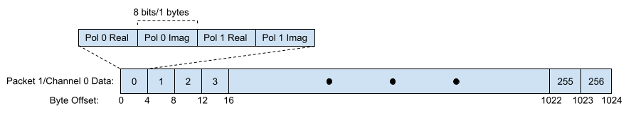
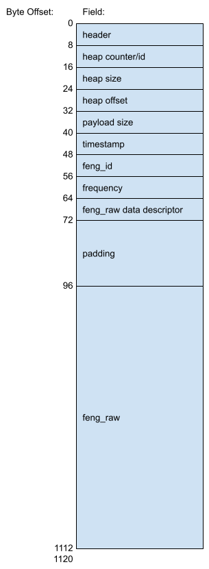

.. _fgpu-packet-format:

Channelised Voltage Data Packet Format
======================================

According to the **MeerKAT M1000-0001 CBF-Data Subscribers ICD (M1200-0001-020)**,
the output SPEAD heaps from the F-Engine have the following data format:

.. figure:: images/feng_spead_heap_format_table.png

  Table indicating SPEAD heap format output by F-Engine

In the case of a 64A 4k Array, each heap contains 4096/(4*64) = 16 channels.
There are 256 time samples per channel. Each sample is dual-pol complex 8 bit data
for a combined sample width of 32 bits or 4 bytes. The heap payload size in this example
is equal to 16 * 256 * 4 bytes. Each channel is transmitted in a separate packet.
256 spectra * 32-bits = 1024 B/ 1 KiB of raw f_eng data per packet:

  F-Engine Packet Format

The SPEAD protocol assigns a number of metadata fields to each packet. Each metadata
field is 64 bits/8 bytes wide. More information on these fields is listed in the
`SPEAD specification`_. The metadata fields are as follows:

.. _SPEAD specification: https://casper.ssl.berkeley.edu/astrobaki/images/9/93/SPEADsignedRelease.pdf

``header``
  Contains information about the flavour of SPEAD being used.
``heap counter/id``
  A unique identifier for each heap.
``heap size``
  Size of the heap in bytes.
``heap offset``
  Address in bytes indicating the current packets location within the heap.
``payload size``
  Number of bytes within the current packet payload.

In addition, each packet has a number of additional 64-bit fields specific
to this heap that are used for reassembling the packets.
The fields are as follows:
``timestamp`` (See above table)

``feng_id`` (See above table)

``frequency`` (See above table)
  Although each packet may represent a different frequency,
  this value remains constant across a heap and represents
  only the first frequency channel in the range of
  channels within the heap.
``feng_raw item pointer`` (See above table)

Eight of the above fields remain constant for all packets in a heap.
The heap offset changes across  packets. Heap offset is expected to change in
multiples of 1024. This is used to reassemble packets of the same heap together
correctly.

This gives nine header fields. The header fields are padded so that the header
is aligned to a 256-bit boundary. As such three 64-bit fields of padding are used.
As such the header is 12 * 8 = 96 bytes. The total F-Engine packet size is
96+1024 = 1100 bytes.

The final UDP datagram payload is as follows:

  Final F-Engine UDP Datagram Payload
