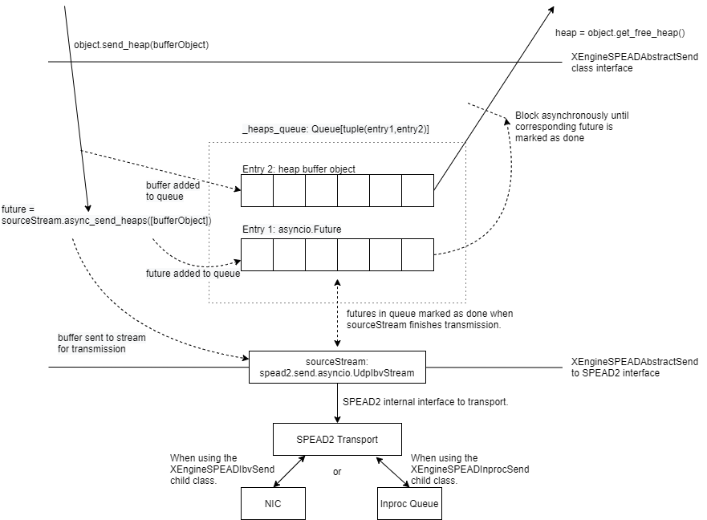

Network Interface Code and SPEAD2
=================================

This file attempts to give an overview of the different moving parts of transmit
and receive code for the katxbgpu program. This explanation attempts to be as
complete as possible, but there are many moving parts to this system so missing
information is likely.

This overview takes place within the context of the MeerKAT telescope as such
the MeerKAT data formats will be discussed.

Key Concepts
------------

Below are some of the key concepts involved:

SPEAD
~~~~~

The Streaming Protocol for Exchanging Astronomical Data (SPEAD) is a protocol
for transmitting radio astronomy data over a network at high data rates. SPEAD
functions as a layer on top of UDP. The documentation for SPEAD can be found
here: `SPEAD`_

.. _SPEAD: https://casper.ssl.berkeley.edu/wiki/SPEAD

SPEAD transmits logical collections of data known as heaps. A heap consists of
one or more UDP packets. A SPEAD transmitter will decompose a heap into packets
and the receiver will collect all the packets and reassemble the heap.

The heaps and corresponding packet formats received by katxbgpu have already
been defined. This `drawing`_ explains these formats in detail.

.. _drawing: https://docs.google.com/drawings/d/1lFDS_1yBFeerARnw3YAA0LNin_24F7AWQZTJje5-XPg

SPEAD2
~~~~~~

SPEAD2 is a software package that implements the SPEAD protocol. It can be used
to both send and receive SPEAD heaps. SPEAD2 is designed to be very
high-performance, able to receive and transmit data losslessly at 100 GbE data
rates when used correctly.

SPEAD2 has both Python and C++ bindings. Python is the conventional way to use
SPEAD2 with C++ being used to implement additional features for high performance
needs.

.. _spead2-transports:

SPEAD2 transports
^^^^^^^^^^^^^^^^^

SPEAD2 has the concept of a "transport". A transport can be thought of the
interface with the underlying system that the SPEAD heaps are transmitted on.
The most basic example of a transport is a UDP transport. SPEAD2 with a UDP
transport will make use of the Linux networking stack to receive packets off of
an Ethernet interface.

SPEAD2 supports a number of different transports including a udp transport for
standard UDP networking, a udp_ibv transport (explained in :ref:`ibverbs`), a
PCAP transport for reading data from a PCAP file, a buffer transport for reading
simulating packets in memory and others.

The advantage of having these different transports is that the interface from
the main program to SPEAD2 can be decoupled from the underlying transport used.
If a new high performance library becomes available for transmitting network
data, it can be added to SPEAD2 without the user having to change their
interface as SPEAD2. SPEAD2 will just transfer a completed heap to the main
program no matter the transport being used.

In this repository, the main example of where these transports are useful is
when unit testing. During normal operation, the udp_ibv transport is used for
high-performance receiving of packets off of the Ethernet network. It is not
practical to run unit tests on the network. When performing unit tests, a buffer
transport is used instead and SPEAD2 assembles simulated packets from a memory
buffer into heaps, thereby testing the SPEAD2 functionality without having to be
connected to the network.

The only intervention required by the user is to tell SPEAD2 what transport to
use. When receiving data, this is done using functions such as
``add_udp_ibv_reader``, ``add_udp_pcap_reader`` or ``add_memory_reader``.

.. todo::

  List the functions required to specify what transport to use for transmitting
  data when the transmit code is added.

.. _ibverbs:

ibverbs
^^^^^^^

SPEAD2 implements a transport using the ibverbs library for high-performance
networking. This is the udp_ibv transport. The udp_ibv transport uses ibverbs
both for sending and receiving data. Using ibverbs for Ethernet NIC acceleration
is not very well documented online. SARAO has produced this
`ibverbs sample project`_ to demonstrate how to use ibverbs and explain how it
functions. A deep understanding of ibverbs is not required here as SPEAD2
handles all of the complexity.

.. _ibverbs sample project: https://github.com/ska-sa/dc_sand/tree/master/ibverbs_sample_project

Ibverbs requires Mellanox ConnectX NICs and the Mellanox OFED drivers to be
installed in order to function.

Asyncio
^^^^^^^

When SPEAD2 is run, it launches its own threads. These threads interact with the
main program using an asyncio loop. When a heap is received or sent, SPEAD2 puts
an event on a specified IO loop indicating that this action has occured.

Multicast
~~~~~~~~~

All SARAO SPEAD traffic is transmitted as Ethernet multicast data. Ethernet
multicast is not as simple as unicast. In general the switches need to be
configured to handle multicast data (using the PIM protocol (in SARAO's case)
for L3 or the IGMP protocol for L2 networks). A receiver also needs to subscribe
to multicast data in order for the network to transmit it to the receiver.
SPEAD2 handles issuing the subscription on the server, the network needs to be
configured to propegate these subscriptions correctly. Ethernet routes stored in
the server OS need to be correctly configured to ensure multicast traffic is
being received or transmitted through the correct interface.

If data is not being transmitted or received correctly, it is best to first
ensure that multicast traffic is being routed correctly on the network.

Chunks
~~~~~~

In order to reduce the load on the slow Python controlling code, multiple SPEAD
heaps are combined into a single chunk in the high performance C++ code before
being passed to Python. Python then launches GPU kernels to operate on a single
chunk. The actual chunk object contains a buffer. The buffer holds the
collection of heaps.

An example of why this is necessary: a single F-Engine output heap is 0.125 MiB.
At 7 Gbps, ~60 000 heaps are passed to Python every second. This is a very high
load on the CPU and results in the Python thread not being able to keep up. A
single chunk consists of a collection of 10 heaps from every antenna for a chunk
size of 10x64x0.125=80MiB. At 7 Gbps, ~90 chunks are passed to Python per
second. This is a much more manageable number of chunks for slow Python code to
deal with.

Additionally, executing a GPU kernel on a large chunk instead of a single heap
allows the kernel to be launched with many more threads meaning far better
utilisation of the GPU takes place.

Receiver
--------

The hard work of collecting heaps into chunks is implemented by spead2. The
katxbgpu code needs only to provide a function to determine where each heap
belongs, by examining the timestamp and F-engine ID. This is compiled (using
numba) on-the-fly in :func:`katgpucbf.xbgpu.recv.make_stream`. On-the-fly
compilation has the advantage that parameters like the number of spectra per
chunk can be treated as constants by LLVM and hence generate more efficient
code.

When spead2 is done populating a chunk, it places it into a ringbuffer. This
ringbuffer supports Python's asynchronous iterator protocol, so is processed
with the idiom ``async for chunk in async_ringbuffer``.

Once a chunk has been popped off the ringbuffer and its data has been consumed
by the GPU, it should be given back to the receiver again using
:meth:`spead2.recv.ChunkRingStream.add_free_chunk`. By reusing the chunk, the
system memory use remains tightly controlled preventing excessive memory use.
Additionally allocating new memory is an expensive operation. By reusing
chunks, this expensive operation is eliminated.

Receiver Chunk Internal Construction
~~~~~~~~~~~~~~~~~~~~~~~~~~~~~~~~~~~~

A chunk contains both a buffer object and associated metadata. For the receiver
chunk this metadata contains a ``present`` boolean array and a chunk ID.

The ``present`` array contains as many elements as heaps in the chunk. A true
value at a specific index indicates that the corresponding heap is present. A
false value indicates that the heap was either not received or was corrupted
and has not been copied correctly into the chunk. It is expected that
99.999999% of heaps will be received over the receiver lifetime. Large numbers
of missing heaps point to a system issue that must be resolved.

.. _data-layout:

Data layout
^^^^^^^^^^^

Each heap contains a single contigous set of data. Indexed as a multidimensional
array, this array looks like: ``heap_data[n_channels_per_stream][n_samples_per_channel][n_pols]``.
The drawing linked above describes these heaps in more detail.

The X-Engine receives data from each F-Engine. There is one F-Engine per antenna
(``n_ants``). For a single timestamp, a chunk combines data from all these
F-Engines that can be indexed as follows:
``chunk_buffer_temp[n_ants][n_channels_per_stream][n_samples_per_channel][n_pols]``

In order to make chunks larger to get the benefits described above, a
number of heaps from every F-Engine are combined into a single chunk. There are
``heaps_per_fengine_per_chunk`` heaps per F-Engine. The final chunk array looks
like:
``chunk_buffer[heaps_per_fengine_per_chunk][n_ants][n_channels_per_stream][n_samples_per_channel][n_pols]``

NOTE: While the data layout is shown here as a multidimensional array, this has
only been done for conceptual purposes. The actual data is stored in a contigous
buffer with one dimension. The user is responsible for striding through this
array correctly.

Timestamp Alignment
^^^^^^^^^^^^^^^^^^^

The timestamp field in the chunk represents the timestamp of the
earliest-received set of F-Engine heaps within the chunk.

Between succesive heaps from a specific F-Engine, the difference in timestamp is
known as the `timestamp_step`. This value is calculated as follows:
`timestamp_step = n_channels_total * 2 * n_samples_per_channel`. It must be
noted that `n_channels_total` is not equal to `n_channels_per_stream`. The first
represents the total number of channels out of the F-Engine while the second
represents the total number of channels in a single heap. These values are
related for power-of-two array sizes but the difference becomes more nuanced
when using arbitrary array sizes. (The exact mechanism calculating
`n_channels_per_stream` for arbitrary array sizes is still TBD.) The `*2` in the
equation above is due to the F-Engines discarding half of the spectrum due to
symmetric properties of a fourier transform on real input data.

As mentioned in :ref:`data-layout`, chunk contains `heaps_per_fengine_per_chunk`
consecutive heaps from a particular F-Engine. The step in time between
timestamps of two consecutive chunks can be calculated using the following:
`timestamp_step_per_chunk = heaps_per_fengine_per_chunk * timestamp_step`.

Chunks do not directly contain a timestamp, but the chunk ID is formed by
dividing the first timestamp of the chunk by `timestamp_step_per_chunk`, and
thus the timestamps can easily be reconstructed.

.. todo::

  Update this section when the channel division for non-power-of-2 array sizes
  is decided upon.

Transport and readers
~~~~~~~~~~~~~~~~~~~~~

As mentioned in :ref:`spead2-transports`, SPEAD2 defines a number of transports.
The most important one is the udp_ibv transport for normal operation.
Additionally, the PCAP and memory transports are also exposed for debugging
and unit tests.

Unit Tests
~~~~~~~~~~

As mentioned previously, the memory transport is used to unit test the receiver
software on simulated packets stored within a buffer.

Sender
------

The X-Engine transmit code can be found in :mod:`.xsend`. Unlike the receiver
logic, the sender logic just makes use of the normal SPEAD2 Python code - no
custom C++ bindings are required. The X-Engine implements accumulation and
drastically reduces data rates. A heap is sent out on the order of seconds, not
milliseconds, and as such no chunking is required to manage these rates.

The :mod:`~katgpucbf.xbgpu.xsend` module defines a number of classes to deal
with transmission. The main parent class for these classes is called the
:class:`~katgpucbf.xbgpu.xsend.XEngineSPEADAbstractSend` class.

The image below gives conceptual overview of how the katxbgpu sender code is
implemented:

  Sender

The above diagram shows how the sender module is broken up into three main
layers:

  1. XEngineSPEADAbstractSend class - This is the interface to the sender
     module. Once the program is running, the main processing loop will request
     free buffers (:meth:`.get_free_heap`) from the xsend module, populate the
     buffers and then tell the module to send these buffers (:meth:`send_heap`).
     The sending happens asynchronously but the xsend class ensures that buffers
     are not recycled until they are sent.
  2. XEngineSPEADAbstractSend internal workings - This class manages a queue of
     buffers being sent on the network in an asynchronous manner. Each buffer
     has an associated future. This class monitors the futures when more buffer
     resources are requested by the main processing loop and will only return a
     free buffer when the corresponding resource is marked as done.
  3. SPEAD2 source_stream - The XEngineSPEADAbstractSend creates a SPEAD2 send
     stream object. Every buffer passed to the XEngineSPEADAbstractSend object
     is given to this source_stream. The source_stream object encapsulates the
     buffer object into a SPEAD heap and sends it out onto the network (in the
     normal case). It returns a future that will be marked as done once the
     transmission is complete.

Peerdirect Support
------------------

SPEAD2 provides support for Nvidia's GPUDirect technology. This allows data to
be copied directly from a Mellanox NIC to a Nvidia GPU without having to go
through system memory. SPEAD2 needs to be using the udp_ibv transport to make
use of GPUDirect. By using GPUDirect, the system memory bandwidth requirements
are significantly reduced as the data does not pass through system RAM.

Currently GPUDirect is not supported on the gaming cards (RTX and GTX cards). It
is only supported on the server-grade cards (such as the A100).

Currently katxbgpu does not make use of the Peerdirect functionality.

.. todo::

  Write a script demonstrating how to use Peerdirect works. Update this description once this script has been written.
