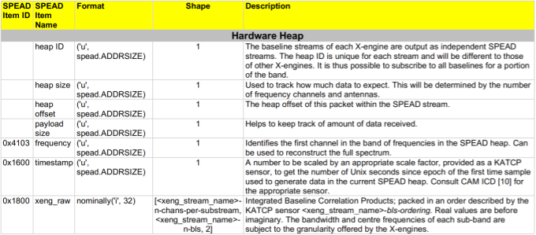

.. _xengine-networking:

XB-Engine Networking
====================

.. todo::

  Work this section into the greater Design one.

Input
-----
The X-engine receives antenna channelised data from the output of the F-engines,
which is largely described in :ref:`fengine-networking`. Each X-engine receives
data from each F-engine, but only from a subset of the channels. Thus the
multicast address subscribed to by the X-engine's input stream has a many-to-one
relationship.

Output Heap Payload
-------------------

Each correlation product contains a real and imaginary sample (both 32-bit
integer) for a combined size of 8 bytes per baseline. The ordering of the
correlation products is given in the :samp:`{xeng-stream-name}-bls-ordering`
sensor in the product controller, but can be calculated deterministically:
:func:`~katgpucbf.xbgpu.correlation.get_baseline_index` indicates the ordering
of the baselines, and the four individual correlation products are always
ordered ``aa, ba, ab, bb``, where `a` and `b` can either be vertical or
horizontal polarisation (``v`` or ``h``), depending on the configuration of the
instrument.

All the baselines for a single channel are grouped together contiguously in the
heap, and each X-engine correlates a contiguous subset of the entire spectrum.
For example, in an 80-antenna, 8192-channel array with 64 X-engines, each X-engine output
heap contains 8192/64 = 128 channels.

The heap payload size in this example is equal to

  channels_per_heap * correlation_products * complex_sample_size = 128 * 12960 * 8 = 13,271,040 bytes or 12.656 MiB.

Output Packet Format
--------------------

According to the **MeerKAT M1000-0001 CBF-Data Subscribers ICD (M1200-0001-020)**,
the Baseline Correlation Products SPEAD packets have the following data format:

  SPEAD packet format output by an X-Engine

In MeerKAT Extension, four correlation products are computed for each baseline,
namely vv, hv, vh, and hh. Thus, for an 80-antenna correlator, there are
:math:`\frac{n(n+1)}{2} = 3240` baselines, and 12960 correlation products. The
parameter ``n-bls`` in the above table refers to the latter figure.

The immediate items specific to the X-engine output stream are as follows:

``frequency`` (See above table)
  Although each packet represents a different frequency,
  this value remains constant across a heap and represents
  only the first frequency channel in the range of
  channels within the heap.

``timestamp`` (See above table)
  .. comment just to get this formatted as definition list

``xeng_raw item pointer`` (See above table)
  .. comment just to get this formatted as definition list

Each X-engine sends data to its own multicast group. A receiver can combine data
from several multicast groups to consume a wider spectrum, using the
``frequency`` item to place each heap. To facilitate this, X-engine output heap
IDs are kept unique across all X-engines in an array.
