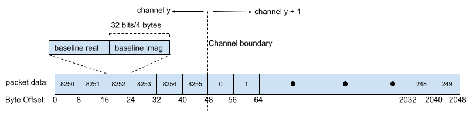
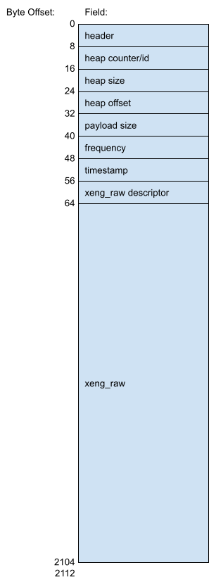

.. _baseline-correlation-products-data-packet-format:

Baseline Correlation Products Data Packet Format
================================================

According to the **MeerKAT M1000-0001 CBF-Data Subscribers ICD (M1200-0001-020)**,
the output SPEAD heaps from the X-Engine have the following data format:

.. figure:: images/xeng_spead_heap_format_table.png

  Table indicating SPEAD heap format output by X-Engine

In MeerKAT, each polarisation out of the X-Engine is treated as a separate antenna. In the
case of a 64A Array we have 128 antpols which equates to (128)(128+1)/2 = 8256 baselines.
Each baseline contains a 32-bit real and 32-bit imaginary sample for a combined size of
8 bytes per baseline. This calculation contains 128 duplicate baselines (one per antpol).
For MeerKAT, these duplicates are removed resulting in 8128 baselines. For the MK+ correlator,
these duplicates are likely to not be removed. The ordering of the baselines is not fixed.
For MeerKAT, the katcp sensor <xeng-stream-name>-bls-ordering describes the order of the
baselines at runtime.

A single SPEAD heap contains multiple channels worth of data. All the baselines for a
single channel are grouped together contiguously. e.g. For a 64 antenna 32k array, each
heap contains 32768/(4x64) = 128 channels. Unlike the F-Engine output packets, the X-Engine
output packets are not aligned on channel boundaries and occur at arbitrary offsets within
a packet.

The heap size is equal to

  channels_per_heap * baselines * complex_sample_size = 128*8256*8 = 8454144 bytes or 8.0625 MiB.

A heap is broken up into multiple packets. The maximum amount of data per packet is set to
2048 bytes or 2 KiB. The last packet in the heap may be smaller to account for the heap size
not always lining up with 2048 byte boundaries. The format of a single packet's data is shown below:

  X-Engine Packet Format

The SPEAD format assigns a number of metadata fields to each packet. Each metadata
field is 64 bits/8 bytes wide. More information on these fields is listed in the
`SPEAD specification`_. The metadata fields are as follows:

.. _SPEAD specification: https://casper.ssl.berkeley.edu/astrobaki/images/9/93/SPEADsignedRelease.pdf

``header``
  Contains information about the flavour of SPEAD being used.
  The most significant bit is always 0x53.
``heap counter/id``
  A unique identifier that increments for each new heap.
``heap size``
  Size of the heap in bytes.
``heap offset``
  Address in bytes indicating the current packets location within the heap.
``payload size``
  Number of bytes within the current packet payload.

In addition, each packet has a number of additional 64-bit fields specific
to this heap that are used for reassembling the packets.

``frequency`` (See above table)
  Although each packet represents a different frequency,
  this value remains constant across a heap and represents
  only the first frequency channel in the range of
  channels within the heap.
``timestamp`` (See above table)

``xeng_raw item pointer`` (See above table)

Seven of the above fields remain constant for all packets in a heap. The heap offset changes across
packets. Heap offset is expected to change in multiples of 2048. This is used to reassemble packets
of the same heap together in the correct order.

This gives eight header fields. These fields align to the 256-bit word boundaries in SPEAD, so unlike
the F-Engine heaps, no padding is required. With eight 64-bit header fields, there are 64 bytes of
header in each packet. The total X-Engine packet size is thus equal to 64+2048 = 2112 bytes.
The final UDP datagram payload is as follows:

  Final X-Engine UDP Datagram Payload
