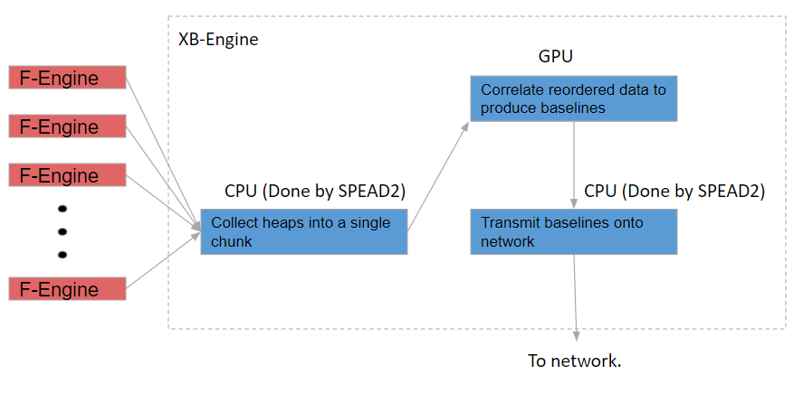
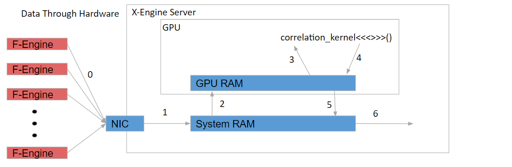
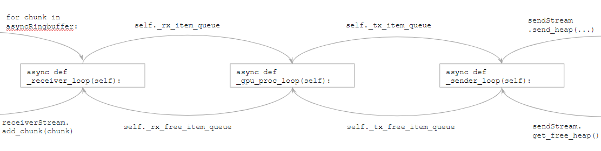
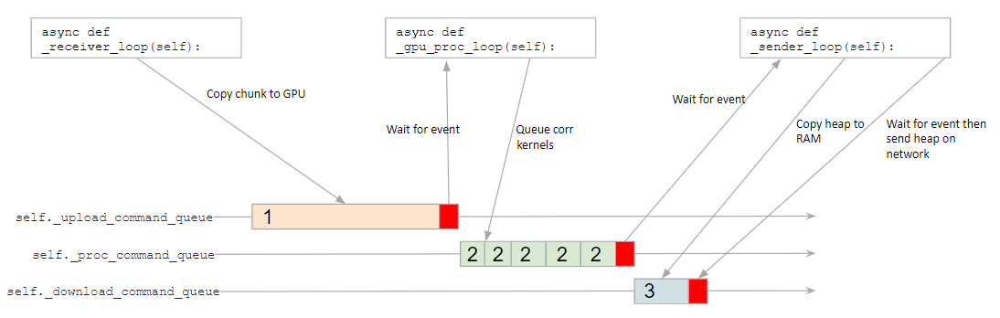

X-Engine Design
===============

.. todo::

   Most of this needs to be folded into the higher-level GPU "Design" document.
   Whatever remains will probably need re-naming under an "XB-engine" sub-
   heading or some such.

Signal Flow
-----------

The general flow of data through the system is shown in the the image below:

  XBGPU Concept

The X-Engine processing pipeline can be broken into three different stages:

  1. Receive data from the network and assemble it into a chunk. This chunk is
     then transferred to the GPU.
  2. The data is then correlated using a modified version of the ASTRON Tensor
     Core Kernel. This is done by the
     :class:`~katgpucbf.xbgpu.correlation.Correlation` class. This correlated
     data is then transferred back to system RAM.
  3. Send the correlated data (known as baseline correlation products) back into
     the network. This is implemented by :mod:`.xsend`.

The image below shows where the data is located at the various stages mentioned above:

  Hardware Path

The numbers in the above image correspond to the following actions:

  0. Receive heaps from F-Engines.
  1. Assemble heaps into a chunk in system RAM.
  2. Transfer chunk to GPU memory.
  3. and
  4. Correlate data and transfer baselines to GPU memory.
  5. Transfer baselines from GPU memory to host memory.
  6. Transfer baselines from host memory to the NIC and onto the network.

Synchronization and Coordination
~~~~~~~~~~~~~~~~~~~~~~~~~~~~~~~~

The :mod:`~katgpucbf.xbgpu.engine` module does the work of assembling all
the different modules into a pipeline. This module has three different async
processing pipelines know as the ``_receiver_loop``, ``_gpu_proc_loop`` and the
``_sender_loop``. Data is passed between these three processing loops using
:class:`asyncio.Queue`\ s. Buffers in queues are reused to prevent unnecessary memory
allocations. Additionally, buffers are passed between the Python program to the
network threads and back in order to reuse these buffers too.

The image below demonstrates how data moves through the pipeline and how it is
reused:

The :class:`asyncio.Queue` objects help to coordinate the flow of data through
the different asyncio functions. However the GPU requires a separate type of
coordination. The GPU has three different command queues that manage the
coordination.

One command queue is for processing and the other two are for transferring data
from host memory to the GPU and back. Events are put onto the command queue and
the async processing loops can :keyword:`await` for these events to be complete.
Often one async function will enqueue some commands followed by an event onto
the GPU command queue and the next async function will :keyword:`await` for this
event to complete as it is the function that needs to work with this data.
Tracking the different events across functions requires a bit of care to prevent
race conditions and deadlock.

The image below shows the interaction between the processing loops and the
command queues:

The numbers in the image above correspond to the following actions:

  1. Copy chunk to GPU memory from host
  2. Correlate chunk
  3. Transfer heap to host memory from GPU

Accumulations, Dumps and Auto-resync
------------------------------------

The input data is accumulated before being output. For every output heap,
multiple input heaps are received.

A heap from a single F-Engine consists of a set number of spectra indicated by
the :option:`!--spectra-per-heap` flag, where the spectra are time samples. Each of
these time samples is part of a different spectrum, meaning that the timestamp
difference per sample is equal to the value of :option:`!--samples-between-spectra`.
The timestamp difference between two consecutive heaps from the same F-Engine is equal to:

  `heap_timestamp_step = --spectra-per-heap * --samples-between-spectra`.

A :dfn:`batch` of heaps is a collection of heaps from different F-Engines with the same
timestamp. A :dfn:`chunk` consists of multiple consecutive batches (the number is given
by the option :option:`!--heaps-per-fengine-per-chunk`). Correlation generally occurs on
a chunk at a time, accumulating results, with the batches of the chunk being
processed in parallel.  To avoid race conditions in accumulation, there are
multiple accumulators, and batch *i* of a chunk uses accumulator *i*.
An accumulation period is called an :dfn:`accumulation` and the data output
from that accumulation is normally called a :dfn:`dump` — the terms are used
interchangeably. Once all the data for a dump has been correlated, the separate
accumulators are added together ("reduced") to produce a final result.  This
reduction process also converts from 64-bit to 32-bit integers, saturating if
necessary.

The number of batches to accumulate in an accumulation
is equal to the :option:`!--heap-accumulation-threshold` flag. The timestamp difference
between succesive dumps is therefore equal to:

  `timestamp_difference = --spectra-per-heap * --samples-between-spectra * --heap-accumulation-threshold`

The output heap timestamp is aligned to an integer multiple of
`timestamp_difference` (equivalent to the current SKARAB "auto-resync" logic).
The total accumulation time is equal to:

  `accumulation_time_s = timestamp_difference * --adc-sample-rate(Hz)` seconds.

The output heap contains multiple packets and these packets are distributed over
the entire `accumulation_time_s` interval to reduce network burstiness. The
default configuration in :mod:`katgpucbf.xbgpu.main` is for 0.5 second dumps
when using the MeerKAT 1712 MSps L-band digitisers.

The dump boundaries are aligned to whole batches, but may fall in the middle of
a chunk. In this case, each invocation of the correlation kernel will only
process a subset of the batches in the chunk.

Implementation details of tensor-core correlator
------------------------------------------------

For an overview of the tensor-core correlator, see the `GTC presentation`_.
This document gets into the low-level details of the implementation. Familiarity
with CUDA (including warp matrix multiplies) as well as the function of a
correlator are assumed.

.. _GTC presentation: https://developer.nvidia.com/gtc/2019/video/s9306

Complex multiplications
^^^^^^^^^^^^^^^^^^^^^^^
The tensor cores can only perform calculations on real numbers. The
correlation kernel takes complex numbers as adjacent pairs of real and
imaginary parts, and constructs matrices in a way that allows complex
multiplications to be performed. The `GTC presentation`_ shows diagrams of
this, so only a brief explanation will be given.

Consider a correlation product :math:`A \times B^H`. The real part of
:math:`(a_r + ja_i)(\overline{b_r + jb_i})` is :math:`a_rb_r + a_ib_i`, so
simply by placing the real and imaginary parts in alternate columns of
:math:`A` and :math:`B`, each dot product between rows will give the desired
real part.

The imaginary part is :math:`a_ib_r - a_rb_i`, so we could construct a second
matrix :math:`B'` containing :math:`(-b_i, b_r)` in each pair of adjacent real
entries (instead of :math:`(b_r, b_i)`), and then the product would give the
imaginary part. If instead of using two separate matrices, we interleave the
rows of :math:`B` and :math:`B'`, the resulting product will interleave the
original products (by column) and hence place the real and imaginary
components together again.

In the code this transformation is implemented by :c:func:`conj_perm`. It uses
some bit manipulations to perform the calculation on a 32-bit integer that
potentially has multiple samples. This code assumes a little-endian
architecture, which is all that CUDA supports. Let's consider the code for
:c:var:`NR_BITS` of 8:

.. code:: c

   __byte_perm(v, 0x00FF00FF - (v & 0xFF00FF00), 0x2705);

In this case :c:var:`v` contains two complex numbers. The mask selects the
imaginary components. These are effectively subtracted from 0 to negate them;
the left-hand side of the subtraction is ``0x00FF00FF`` rather than 0 so that
the lower component doesn't cause a carry that affects the higher component.
The other two bytes of the result are not relevant. Next, :c:func:`__byte_perm`
selects the four desired bytes in the appropriate order.

It should be noted that this transformation will map -128 to itself rather than
+128, because +128 cannot be represented in a two's-complement int8. The
caller is responsible for ensuring that this input value is not used.

Parameters and constants
^^^^^^^^^^^^^^^^^^^^^^^^
:c:macro:`NR_BITS` specifies the type of the incoming samples:

- 4 means each byte contains a packed 4-bit real and 4-bit imaginary.
- 8 means the real and imaginary components are signed bytes.
- 16 means half-precision float.

:c:macro:`N_SAMPLES_PER_CHANNEL` is the number of samples in time processed in
a single call to the kernel. These are divided into groups of
:c:macro:`N_TIMES_PER_BLOCK`, which is the number loaded into shared memory at
a time before computing with them. Changing :c:macro:`N_TIMES_PER_BLOCK` would
require substantial changes to the loading code: the fetches are hard-coded to
use a certain number of bits of the thread ID to index this dimension.
Increasing it significantly (e.g., to match the 256 that is native to MeerKAT)
would probably require too much shared memory.

:c:macro:`NR_STATIONS_PER_BLOCK` refers to the size of the subsets of antenna
data in the input matrix which will be correlated per thread block.  It has
three possible values (32, 48 and 64) which correspond to processing 32×32,
48×48 or 64×32 (*not* 64×64) regions of the correlation matrix. This leads
to the expression ``NR_STATIONS_PER_BLOCK == 64 ? 32 : NR_STATIONS_PER_BLOCK``
appearing in a lot of places.

:c:macro:`NR_CHANNELS` is the number of channels over which to correlate, but
there seems to be little need for this to be baked into the kernel. It only
forms the outermost dimension of the inputs and outputs, and the Y axis of the
thread grid, and could just as easily be dynamic.

:c:macro:`NR_STATIONS_PER_TCM_X` and :c:macro:`NR_STATIONS_PER_TCM_Y` are the
number of (dual-pol) antennas per warp matrix multiply. Keeping in mind that
the "Y" station corresponds to rows (and to :c:var:`aSamples` temporary
storage, with "X" corresponding to :c:var:`bSamples`), this is 8×4 (4×2 for
4-bit samples). With dual-pol antennas that equates to 16×8 inputs. The reason
it is not 16×16 (to match the matrix shape supported by the tensor cores) is
the expansion of the B matrix for complex multiplication as described above.

In :c:func:`doCorrelateRectangle`, :c:var:`nrFragmentsX` and
:c:var:`nrFragmentsY` indicate the number of "fragments" (tensor-core
matrices) that the *warp* (not the thread block) is responsible along each
dimension.

Thread indexing
^^^^^^^^^^^^^^^
There is a hard-coded value of 4 warps per block, arranged as 32×2×2. The first
axis simply determines the position within a warp. The other two axes are used
for different purposes in different parts of the code. Most typically, they
subdivide the output block into quadrants (so for example a 64×32 output block
is divided into four 32×16 output blocks, with one warp responsible for
computing each). In loading code, the :c:var:`threadIdx` is flattened into a
1D index (:c:var:`tid`).

The thread grid is 2D. The :c:var:`y` axis indicates the channel, while the
:c:var:`x` axis selects an output block within the output triangle. Some
trickery with square roots is used to perform this mapping.

When :c:var:`NR_STATIONS_PER_BLOCK` is 32 or 48, the output space is dealt with
in square blocks, in :c:func:`doCorrelateRectangle`. The correlation matrix
is conjugate symmetric, so this involves computing some redundant elements,
which are discarded as part of :c:func:`storeVisibilities`. When it is 64,
things get more complicated: certain blocks are processed with
:c:func:`doCorrelateTriangle`, which is optimised for blocks that lie on the
main diagonal.

.. tikz:: Block, warp and fragment layout when :c:macro:`NR_STATIONS_PER_BLOCK` is 64
   and :c:macro:`NR_BITS` is 8 or 16.
   :libs: decorations.pathreplacing

    [x=0.08cm, y=-0.08cm, brace/.style={decorate, decoration={brace, amplitude=4}}]
    \foreach \x/\y/\b in {0/64/1, 32/64/2, 0/128/4, 32/128/5, 64/128/6, 96/128/7}
    {
        \fill[fill=green!10!white] (\x, \y) rectangle +(32, 64);
        \draw[xstep=4, ystep=-8, help lines] (\x, \y) grid +(32, 64);
        \draw[xstep=16, ystep=-32, thin] (\x, \y) grid +(32, 64);
        \draw[thick] (\x, \y) rectangle +(32, 64);
        \path (\x, \y) +(16, 32) coordinate (lbl\b);
        \node[fill=white] at (lbl\b) {\b};
    }
    \foreach \x/\b in {0/0, 64/3, 128/8}
    {
        \fill[fill=blue!10!white] (\x, \x) -- +(0, 64) -- +(64, 64) -- cycle;
        \foreach \diag in {0, 24, 48}
        {
            \fill[fill=red!10!white] (\x, \x) ++(\diag, \diag) -- +(0, 16) -- +(16, 16) -- cycle;
            \foreach \oy/\maxx in {0/4, 8/12}
                \foreach \ox in {0, 4, ..., \maxx}
                {
                    \draw[help lines] (\x, \x) ++(\diag, \diag) ++(\ox, \oy) rectangle +(4, 8);
                }
        }
        \foreach \ox/\oy in {0/16, 0/40, 24/40}
        {
            \draw[xstep=4, ystep=-8, help lines] (\x, \x) ++(\ox, \oy) grid +(24, 24);
            \draw[thin] (\x, \x) ++(\ox, \oy) rectangle +(24, 24);
        }
        \draw[thick] (\x, \x) -- +(0, 64) -- +(64, 64) -- cycle;
        \path (\x, \x) +(24, 40) coordinate (lbl\b);
        \node[fill=white] at (lbl\b) {\b};
    };
    \draw[very thick] (0, 0) rectangle (192, 192);
    \draw[very thick] (0, 0) -- (192, 192);
    \node[anchor=east] at (0, 96) {Y};
    \node[anchor=south] at (96, 0) {X};
    \draw[brace] (0, 192) to node[auto]{\tiny 64} (0, 128);
    \draw[brace] (32, 192) to node[auto]{\tiny 32} (0, 192);
    \draw[brace] (0, 128) to node[auto]{\tiny 32} (0, 96);
    \draw[brace] (48, 192) to node[auto]{\tiny 16} (32, 192);
    \draw[brace] (0, 72) to node[auto]{\tiny 8} (0, 64);
    \draw[brace] (64, 192) to node[auto]{\tiny 4} (60, 192);

The figure above illustrates the arrangement for a 192-antenna array. The
numbers in white boxes are the block IDs (:c:var:`blockIdx.x`). Each green
block is processed with :c:func:`doCorrelateRectangle`; it is shown divided
into four quadrants (corresponding to the warps) and further subdivided into
the fragments computed by each warp. The red/blue blocks are processed with
:c:func:`doCorrelateTriangle`. The three blue regions are processed using
warps 1-3 (a lookup table indicates the starting position), while the three
red areas in each triangle are handled by warp 0.

When :c:macro:`NR_BITS` is 4 the situation is very similar, but the fragments
are 4×2 instead of 8×4.

Data loading
^^^^^^^^^^^^
A batch of voltage samples is loaded into shared memory, then used from there.
Since each warp is computing multiple output fragments, each voltage is used
by multiple matrix multiplies, and so caching them in shared memory reduces
global memory traffic. The shared memory is also double-buffered, which is
presumably to increase instruction-level parallelism and reduce the number of
synchronisations required.

Rather than perform loads using the natural type of the samples, they are
performed using wide types like :c:type:`int4`, presumably to make more
efficient use of the memory type, and type-casts pointers to access the raw
memory. It should be noted that this sort of type-punning is `undefined
behaviour`_ in C++, but there doesn't seem to be a safer alternative
(``memcpy`` is safe but it works one byte at a time, which destroyed
performance).

.. _undefined behaviour: https://gist.github.com/shafik/848ae25ee209f698763cffee272a58f8

Loading is implemented using the :cpp:class:`FetchData` class. At construction
time it takes thread-specific offsets to the station (antenna), polarisation
and time. The :cpp:func:`load` member functions takes base channel, time
and station that are uniform across the block. If the specific element to
access is outside the bounds, the data is not loaded and left as zero.

Asynchronous loading
~~~~~~~~~~~~~~~~~~~~

.. note::

   The asynchronous loading support has been removed in the katgpucbf
   fork, as it was not really compatible with the axis reordering. This
   section is left as a reference should it be brought back in future.

When there is support in hardware (Compute Capability 8.0 or later, i.e.,
Ampere) and a new enough CUDA version, an asynchronous memory copy is used for
extra latency hiding (or possibly to reduce register pressure). It's
implemented using an experimental (and deprecated) version of the API; for
reference one needs to read the 11.1 CUDA programming guide rather than the
latest version.

The :c:macro:`READ_AHEAD` macro is slightly confusing. Let's assume a large
enough :c:macro:`NR_SAMPLES_PER_CHANNEL` that :c:macro:`READ_AHEAD` is 2 and
:c:macro:`NR_SHARED_BUFFERS` is 4. Then the following can all be occurring
simultaneously:

1. Reading from shared buffer `i` to do the computations.
2. Asynchronous copies to shared buffers `i + 1` to `i + 3`, inclusive (note
   that accounts for 3 buffers, not 2).

Within a single thread there can only be two async copies outstanding while
doing the computations, because before starting computation on a buffer it
waits for the copy targeting that buffer to complete. But because there is no
call to :c:func:`__syncthreads` between the end of computation and the
scheduling of the following copy, the scenario above can occur overall, with
different threads in different parts of the loop. This explains why 4 buffers
are needed.

Result storage
^^^^^^^^^^^^^^
The result storage is particularly complicated in an attempt to optimise the
process. CUDA says that the :c:type:`fragment` type has
implementation-defined memory layout, and the individual matrix elements can
only be portably read by using :c:func:`store_matrix_sync` to write the
results to shared or global memory. The memory layouts supported by this
function don't correspond to the packed triangular shape the kernel wants, so
some extra steps are required.

For a set of recognised architectures, the elements of the fragment class are
read directly, using knowledge of the architecture-specific memory layout. In
the fallback case (where :c:macro:`PORTABLE` is defined), the fragment is
written to shared-memory scratch space then read back to extract the elements.

The upstream code is designed to do all the accumulation inside the kernel, by
passing in all the data for the entire dump. While this is efficient (only
writing results to global memory once), it would limit the dump period based
on the available memory. In katgpucbf, the code has been modified so that
results are added to the existing values in global memory.
