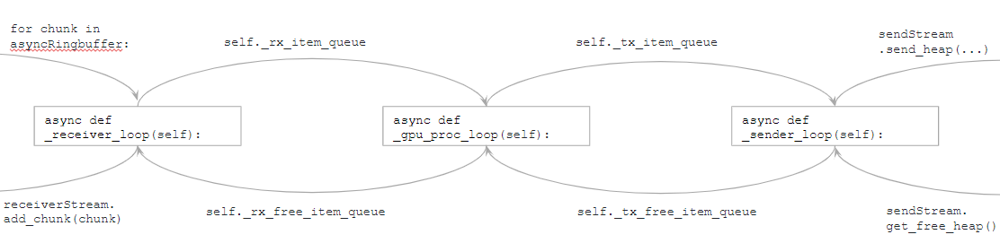

# Theory Of Operation

## Signal Flow

The general flow of data through the system is shown in the the image below:

The X-Engine processing pipeline can be broken into four different stages:
1. Receive data from the network and assemble it into a chunk. This chunk is then transferred to the GPU. This receiver
has been implemented using SPEAD2 in C++ and bound into python. See the "SPEAD2 Network Side Software" section below
for more information. 
2. Reorder the chunk so that it is in a format that is ready for correlation. This reorder is implemented in the
[precorrelation_reorder.py](../katxbgpu/precorrelation_reorder.py) module.
3. The data is then correlated using the ASTRON Tensor Core Kernel. This is done by the 
[tensorcore_xengine_core.py](../katxbgpu/tensorcore_xengine_core.py) class. This correlated data is then transferred back to
system RAM.
4. Send the correlated data (known as baseline correlation products) back into the network. This is implemented by
the [xsend.py](../katxbgpu/xsend.py) module.

The image below shows where the data is located at the various stages mentioned above:

The numbers in the above image correspond to the following actions:

0\. Receive heaps from F-Engines. 
1\. Assemble heaps into a chunk in system RAM. 
2\. Transfer chunk to GPU memory. 
3\. & 4. Launch a GPU kernel to reorder a chunk and transfer reordered data back to GPU memory.
5\. & 6. Correlate reordered data and transfer baselines to GPU memory. 
7\. Transfer baselines from GPU memory to host memory. 
8\. Transfer baselines from host memory to the NIC and onto the network. 

### Synchronization and Coordination

The [xbengine.py](../katxbgpu/xbengine.py) module does the work of assembling all the different modules
into a pipeline. This module has three different async processing pipelines know as the `_receiver_loop`,
`_gpu_proc_loop` and the `_sender_loop`. Data is passed between these three processing loops using `asyncio.Queues`.
Buffers in queues are reused to prevent unecessary memory allocations. Additionally, buffers are passed between the
python program to the network threads and back in order to reuse these buffers too.

The image below demonstrates how data moves through the pipeline and how it is reused:

The `asyncio.Queues` help to coordinate the flow of data through the different asyncio functions. However the GPU
requires a seperate type of coordination. The GPU has three different command queues that manage the coordination. 
A command queue is an OpenCL term - within katsdpsigproc, this is still called a command queue even though it can be
implemented as a CUDA stream. One command queue is for processing and the other two are for transferring data from host
memory to the GPU and back. Events are put onto the command queue and the async processing loops can `await` for these
events to be complete. Often one async function will enqueue some commands followed by an event onto the GPU command
queue and the next async function will `await` for this event to complete as it is the function that needs to work with
this data. Tracking the different events across functions requires a bit of care to prevent race conditions and
deadlock.

The image below shows the interaction between the processing loops and the command queues:

The numbers in the image above correspond to the following actions:
1. Copy chunk to GPU memory from host 
2. Reorder Chunk
3. Correlate chunk
4. Transfer heap to host memory from GPU

## Accumulations, Dumps and Auto resync

The input data is accumulated before being output. For every output heap, multiple input heaps are received.

A heap from a single F-Engine consists of a set number of samples specified by the `--samples-per-channel` flag. Each
of these time samples is part of a different spectrum. Meaning that the timestamp difference per sample is
equal to the `--channels-total` multiplied by 2 (multiple for two to account for the fact that we throw half the
spectrum away due to the symmetric properties of the Fourier Transform). The timestamp difference between consecutive
two heaps from the same F-Engine is equal to: `--samples-per-channel * --channels-total * 2`.

A batch of heaps is a collection of heaps from different F-Engines with the same timestamp. Correlation occurs on a
batch of heaps at a time. The correlated data is then accumulated. An accumulation period is called an __accumulation__
and the data output from that accumulation is normally called a __dump__ - the terms are used interchangeably. The
number of batches to accumulate in an accumulation is equal to the `--heap-accumulation-threshold` flag. The timestamp
difference between succesive dumps is equal to: 
`timestamp_difference = --samples-per-channel * --channels-total * 2 * --heap-accumulation-threshold`

The output heap timestamp is aligned to an integer multiple of `timestamp_difference` 
(equivalent to the current SKARAB "auto-resync" logic). The total accumulation time is equal to:
`accumulation_time_s = timestamp_difference * --adc-sample-rate(Hz)` seconds.

The output heap contains multiple packets and these packets are distributed over the entire `accumulation_time_s`
interval to reduce network burstiness. The default configuration in [main.py](../katxbgpu/main.py) is for 0.5 second
dumps when using the MeerKAT 1712 MSPs L-band digitisers.

## Network Interface Code and SPEAD2

A complete description of networking can be found [here](./networking.md).