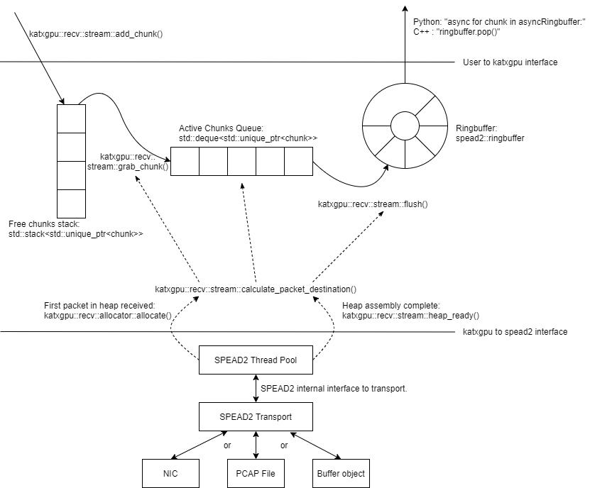

# Network Interface Code and SPEAD2

This README attempts to give an overview of the different moving parts of transmit and receive code for the katxgpu
program. This explanation attempts to be as complete as possible, but there are many moving parts to this system so 
missing information is likely. 

This overview takes place within the context of the MeerKAT telescope as such the MeerKAT data formats will be
discussed.

## 1. Key Concepts

Below are some of the key concepts involved:

### 1.1 SPEAD

The Streaming Protocol for Exchanging Astronomical Data (SPEAD) is a protocol for transmitting radio astronomy data 
over a network at high data rates. SPEAD functions as a layer on top of UDP. The documentation for SPEAD can be found
[here](https://casper.ssl.berkeley.edu/wiki/SPEAD).

SPEAD transmits logical collections of data known as heaps. A heap consists of multiple UDP packets. A SPEAD 
transmitter will decompose a heap into packets and the receiver will collect all the packets and reassemble the heap.

The heaps and corresponding packet formats received by katxgpu have already been defined. This 
[document](https://docs.google.com/drawings/d/1lFDS_1yBFeerARnw3YAA0LNin_24F7AWQZTJje5-XPg) explains these formats in 
detail.

### 1.2 SPEAD2

SPEAD2 is a software package that implements the SPEAD protocol. It can be used to both send and receive SPEAD heaps.
SPEAD2 is designed to be very high performance, able to receive and transmit data losslessly at 100 GbE data rates when
used correctly.

SPEAD2 has both Python and C++ bindings. Python is the conventional way to use SPEAD2 with C++ being used to implement 
additional features for high performance needs.

The documentation for SPEAD2 can be found [here](https://spead2.readthedocs.io/en/latest/). An index of all the 
different SPEAD2 functions can be found [here](https://spead2.readthedocs.io/en/latest/genindex.html).

#### 1.2.1 SPEAD2 transports

SPEAD2 has the concept of a "transport". A transport can be thought of the interface with the underlying system that the
SPEAD heaps are transmitted on. The most basic example of a transport is a UDP transport. SPEAD2 with a UDP transport
will make use of the Linux networking stack to receive packets off of an ethernet interface. 

SPEAD2 supports a number of different transports including a udp transport for standard UDP networking, a udp_ibv
transport (explained in 1.2.2 below), a PCAP transport for reading data from a PCAP file, a buffer transport for reading
simulating packets in memory and others. 

The advantage of having these different transports is that the interface from the main program to SPEAD2 can be
decoupled from the underlying transport used. If a new high performance library becomes available for transmitting
network data, it can be added to SPEAD2 without the user having to change their interface as SPEAD2. SPEAD2 will just
transfer a completed heap to the main program no matter the transport being used.

In this repository, the main example of where these transports are useful is when unit testing. During normal
operation, the udp_ibv transport is used for high performance receiving of packets off of the ethernet network. It is
not practical to run unit tests on the network. When performing unit tests, a buffer transport is used instead and
SPEAD2 assembles simulated packets from a memory buffer into heaps, thereby testing the SPEAD2 functionality without
having to be connected to the network.

The only intervention required by the user is to tell SPEAD2 what transport to use. When receiving data, this is done
using functions such as `add_udp_ibv_reader`, `add_udp_pcap_reader` or `add_memory_reader`.

TODO: List the functions required to specify what transport to use for transmitting data when the tranmit code is added.

#### 1.2.2 ibverbs

SPEAD2 implements a transport using the ibverbs library for high performance networking. This is the udp_ibv transport.
Using ibverbs for ethernet NIC acceleration is not very well documented online. SARAO has produced this 
[ibverbs sample project](https://github.com/ska-sa/dc_sand/tree/master/ibverbs_sample_project) to demonstrate how to 
use ibverbs and explain how it functions. A deep understanding of ibverbs is not required here as SPEAD2 handles all
of the complexity. 

Ibverbs requires Mellanox ConnectX NICs and the Mellanox OFED drivers to be installed in order to function. This is
explained in more detail in the top level [README](../README.md).

#### 1.2.3 Asyncio

When SPEAD2 is run, it launches its own threads. These threads interact with the main program using an asyncio loop. 
When a heap is received or sent, SPEAD2 puts an event on a specified IO loop indicating that this action has occured.

### 1.3 Multicast

All SARAO SPEAD traffic is transmitted as ethernet multicast data. Ethernet multicast is not as simple as unicast. In
general the switches need to be configured to handle multicast data (using an implementation of the PIM protocol for L3
or the IGMP protocol for L2 networks.). A receiver also needs to subscribe to multicast data in order for the network
to transmit it to the receiver. SPEAD2 handles issuing the subscription on the server, the network needs to be
configured to propegate these subscriptions correctly. Ethernet routes stored in the server OS need to be correctly
configured to ensure multicast trafficis being received or transmitted through the correct interface.

If data is not being transmitted or received correctly, it is best to first ensure that multicast traffic is being
routed correctly on the network.

### 1.4 Chunks

In order to reduce the load on the slow Python controlling code, multiple SPEAD heaps are combined into a single chunk
in the high performance C++ code before being passed to Python. Python then launches GPU kernels to operate on a single 
chunk.

An example of why this is necessary: a single F-Engine output heap is 0.125 MiB. At 7 Gbps, ~60 000 heaps are passed to
python every second. This is a very high load on the CPU and results in the python thread not being able to keep up. A
single chunk consists of a collection of 10 heaps from every antenna for a chunk size of 10x64x0.125=80MiB. At 7 Gbps,
~90 chunks are passed to python per second. This is a much more manageable number of chunks for slow Python code to deal
with.

Additionally, executing a GPU kernel on a large chunk instead of a single heap allows the kernel to be launched with
many more threads meaning far better utilisation of the GPU takes place.

### 1.5 Low level C++ code and python bindings

katxgpu does not make use of the SPEAD2 python bindings. Instead it makes use of the lower level C++ SPEAD2 functions 
and then exposes them to python with its own bindings. This was done because ordinarily SPEAD2 does not have the concept
of a chunk. Using C++ to implement SPEAD2 allows these heaps to be assembled into chunks before transferring them to
python.

The C++ code can be quite dense and complicated. Much effort has been put into making katxgpu readable and functional
without having to delve into the C++ code.

The [pybind11 library](https://pybind11.readthedocs.io/en/stable/index.html) is used for registering C++ code as a
python module. The C++ files doing this can be found in the [katxgpu/src](.) directory. The [setup.py](../setup.py) file
handles turning these C++ files into python modules. The [py_register.cpp](./py_register.cpp) contains the
`PYBIND11_MODULE` macro which kicks off the process during installation.

## 2. Receiver

The image below gives conceptual overview of how the katxgpu receive code is implemented:

The above diagram shows how the receiver code is broken up into three main sections:
1. katxgpu Python - This is the python code that the main program will interact with to use the receiver. Once the
receiver is configured the main program gives the katxgpu python code new chunks (or old chunks that no longer have any
use) and the katxgpu python code returns filled chunks. The underlying assembly and management of these chunks is
abstracted away at this level. The classes relevant at this level can be found in the [py_recv.cpp](./py_recv.cpp),
[py_recv.h](./py_recv.h), [py_common.cpp](./py_recv.cpp) and [py_common.h](./py_recv.h). These files are slightly
difficult to read, but the python modules they create will have standard python docstrings that can be read in an
iPython session once the module has been installed.
2. katxgpu C++ - The katxgpu python code interfaces with the katxgpu C++ code. The katxgpu C++ code manages the chunks
received from katxgpu python. When the SPEAD2 stream receives a heap, the katxgpu C++ software tells it both to which
chunk the heap must be copied to and the offset within the chunk buffer that the heap data belongs. The katxgpu receiver
monitors the active chunks that are being filled by the SPEAD2 stream and when a chunk is complete, it sends it back to
the katxgpu Python module via a ringbuffer. The classes relevant to this section can be found in [recv.h](./recv.h) and
[recv.cpp](./recv.cpp). 
3. SPEAD2 Stream - This is the underlying SPEAD2 code that receives packets, assembles them into heaps and passes them
to the katxgpu C++ software. This code creates its own thread pool and runs concurrently with the main katxgpu program.
This code is all part of the standrd SPEAD2 package.

An example of how to use the receiver can be found in the [receiver_example.py](../scratch/receiver_example.py) script in
the katxgpu/scratch folder. Understanding this [receiver_example.py](../scratch/receiver_example.py) is all that is 
required to use the receiver. The remaining information in this document is only relevant when trying to modify or 
duplicate the katxgpu receiver functionality.

Once the katxgpu module has been installed, the receiver module can be accesed using `import katxgpu._katxgpu.recv` in
Python.

### 2.2 Chunk Lifecycle

A chunk is the main mechanism that allows for data to be transferred around the katxgpu program

A chunk has to be created by the main program. The user assigns a buffer of a specific size to the chunk and then passes
the chunk to the receiver using the `add_chunk()` function. This chunk is added to a free chunks stack. Chunks on this
stack are not being used. They will be popped off of this stack when a new chunk is required.

The katxgpu C++ code maintains a queue of chunks that are in an "active" state. Active chunks are chunks that are being
assembled - this means that the SPEAD2 stream is busy receiving and assembling heaps from the underlying transport.
These heaps are assembled in the various chunks in the active hunks queue. When a packet belonging to a chunk that is
not in the active queue is received, a chunk is moved from the free chunks stack by calling the
`katxgpu::recv::stream::grab_chunk()` function.

Once a chunk has been fully assembled it is moved off of the active queue and put on a ringbuffer using the
`katxgpu::recv::stream::flush()` function. The main program can then access the underlying chunks asynchronously in
Python using an asyncio for loop (`async for chunk in asyncRingbuffer`) which calls the underlying `ringbuffer.pop()`
function.

Once a chunk has been popped off the ringbuffer and its data has been consumed by the GPU, it should be given back to
the receiver again using the `add_chunk()` function. By reusing the chunk, the system memory use remains tightly
controlled preventing excessive memory use. Additionally allocating new memory is an expensive operation. By reusing
chunks, this expensive operation is eliminated.

The main program only knows about the ringbuffer, the free chunks stack and the active chunks queue are managed within
the katxgpu C++ code.

### 2.3 Chunk and heap coordination and management

The SPEAD2 stream creates its own thread pools which manages the internals of the SPEAD2 transports and heap assembly. 
Tracing through these threads is a time consuming process and is not necessary to understand the katxgpu receiver. The
SPEAD2 stream interacts with the main program using callback functions. When the first packet in a heap is received, the
SPEAD2 stream calls the `katxgpu::recv::allocator::allocate()` function. When the last packet is received, the SPEAD2
stream calls the `katxgpu::recv::stream::heap_ready()` function. Both of these functions eventually call the
`katxgpu::recv::stream::calculate_packet_destination()` function. 

The `calculate_packet_destination()` function can be thought of as the main coordinating funtion within the katxgpu C++
code. It determines when to move data from the free chunks stack to the active chunks queue to the ringbuffer. It also
calculates where in a chunk the heap must be copied and passes this information to the SPEAD2 stream. Understanding this
function will give a great deal of insight into the operation of the entire receiver.

### 2.4 Receiver Chunk Internal Construction

A chunk contains both a buffer object and associated metadata. For the receiver chunk this metadata contains a `present` boolean array and a timestamp field. 

This array will contains as many elements as heaps in the chunk. A true value at a specific index indicates that the corresponding chunk is present. A false value indicates that the chunk was either not received or was corrupted and has not been copied correctly into the chunk. It is expected that 99.999999% of heaps will be received over the receiver lifetime. Large numbers of missing heaps point to a system issue that must be resolved.

### 2.4.1 Data layout

Each heap contains a single contigous set of data. Indexed as a multidimensional array, this array looks like:
`heap_data[n_channels_per_stream][n_samples_per_channel][n_pols]`. As mentioned above, this
[document](https://docs.google.com/drawings/d/1lFDS_1yBFeerARnw3YAA0LNin_24F7AWQZTJje5-XPg) describes these heaps in
more detail.

The X-Engine receives data from each F-Engine. There is one F-Engine per antenna (`n_ants`). For a single timestamp, a
chunk combines data from all these F-Engines that can be indexed as follows:
`chunk_buffer_temp[n_ants][n_channels_per_stream][n_samples_per_channel][n_pols]`

In order to make chunks larger to get the benefits described in 1.4 above, a number of heaps from every F-Engine are
combined into a single chunk. There are `heaps_per_fengine_per_chunk` heaps per F-Engine. The final chunk array looks
like: `chunk_buffer[heaps_per_fengine_per_chunk][n_ants][n_channels_per_stream][n_samples_per_channel][n_pols]`

NOTE: While the data layout is shown here as a multidimensional array, this has only been done for conceptual purposes.
The actual data is stored in a contigous buffer with one dimension. The user is responsible for striding throught this
array correctly.

### 2.4.2 Timestamp Alignment

The timestamp field in the chunk represents the timestamp of the earliest received set of F-Engine heaps within the chunk. 

Between succesive heaps from a specific F-Engine, the difference in timestamp is known as the `timestamp_step`. This value is calculated as follows: `timestamp_step = n_channels_total * 2 * n_samples_per_channel`. It must be noted that `n_channels_total` is not equal to `n_channels_per_stream`. The first represents the total number of channels out of the F-Engine while the second represents the total number of channels in a single heap. These values are related for power-of-two array sizes but the difference becomes more nuanced when using arbitrary array sizes. (The exact mechanism calculating `n_channels_per_stream` for arbitrary array sizes is still TBD.) The `*2` in the equation above is due to the F-Engines discarding half of the spectrum due to symmetric properties of a fourier transform on real input data.

As mentioned in 2.4.1, chunk contains `heaps_per_fengine_per_chunk` consecutive heaps from a particular F-Engine. The step in time between timestamps of two consecutive chunks can be calculated using the following: `timestamp_step_per_chunk = heaps_per_fengine_per_chunk * timestamp_step`. 

TODO: Update this section when the channel division for non-power-of-2 array sizes is decided upon.

### 2.5 Transport and readers

As mentioned in 1.2.1 above, SPEAD2 defines a number of transports. This receiver only exposes three of these
transports. The most important one is the udb_ibv transport for normal operation. Additionally, the PCAP and memory
transports are also exposed for debugging and unit tests.

### 2.6 Unit Tests

As mentioned previously, the memory transport is used to unit test the receiver software on simulated packets stored
within a buffer. The unit test can be found [here](../test/spead2_receiver_test.py) in the katxgpu/test folder.

## 3. Sender

TODO: Sender logic still needs to be implemented. This section will be updated once this has occured.

## 4. Peerdirect Support

SPEAD2 provides support for Nvidias GPU Direct technology. This allows data to be copied directly from a Mellanox NIC
to a Nvidia GPU without having to go through system memory. SPEAD2 needs to be using the udp_ibv transport to make use
of GPU direct. By using GPU direct, the system memory bandwidth requirements are significantly reduced as the data never
does not pass through system RAM.

Currently GPU Direct is not supported on the gaming cards (RTX and GTX cards). It is only supported on the server grade
cards (such as the A100.).

TODO: Write a script demonstrating how to use Peerdirect works. Update this descrption once this script has been written.
