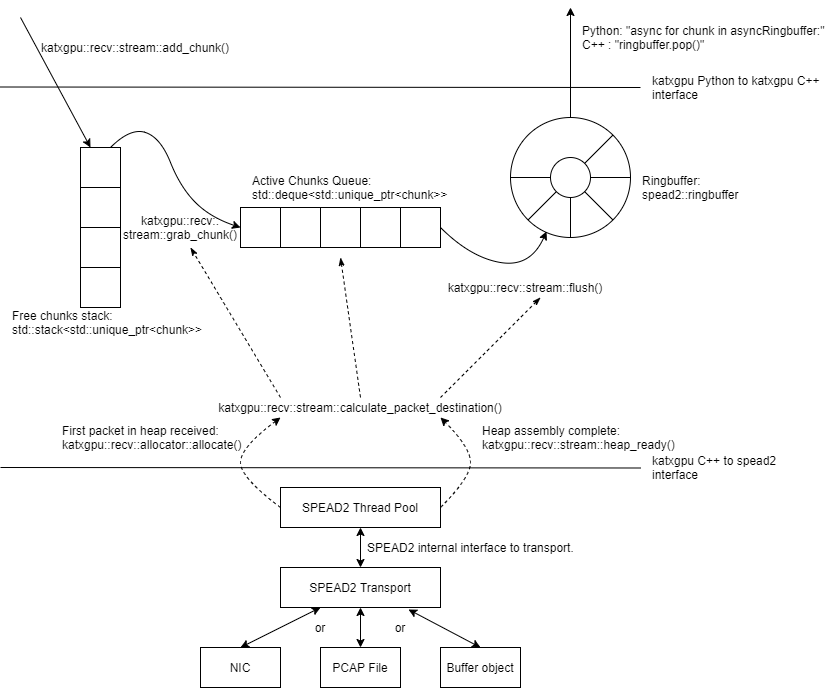

# Network Interface Code and SPEAD2

## 1. Key Concepts

### 1.1 SPEAD

Heaps - logical collection of data broekn into packets

[Documentation](https://casper.ssl.berkeley.edu/wiki/SPEAD)

[Packet formats](https://docs.google.com/drawings/d/1lFDS_1yBFeerARnw3YAA0LNin_24F7AWQZTJje5-XPg)

### 1.2 SPEAD2

[Documentation](https://spead2.readthedocs.io/en/latest/), [Function Index](https://spead2.readthedocs.io/en/latest/genindex.html)

#### 1.2.1 ibverbs

[ibverbs sample project](https://github.com/ska-sa/dc_sand/tree/master/ibverbs_sample_project)

#### 1.2.2 Asyncio

### 1.3 Chunks

### 1.4 Merging C++ and Python code (Change the title a bit)

#### 1.4.1 Need for C++ code

#### 1.4.2 Pybind11

Look at [py_register.cpp](./py_register.cpp)

## 2. Receiver

### 2.1 Top level view

bindings can be found [py_recv.cpp](./py_recv.cpp) and [py_recv.h](./py_recv.h)

logic can be found [recv.cpp](./recv.cpp) and [py_recv.h](./recv.h)

Example can be found here: [example](../scratch/receiver_example.py)

Discuss user side functionality

### 2.2 Chunk Lifecycle

### 2.3 Allocating heaps to chunks

#### 2.3.1 Timestamp Alignment

#### 2.3.2 Data layout in a chunk

[heaps_per_fengine_per_chunk][n_ants][n_channels_per_stream][n_samples_per_channel][n_pols]

### 2.4 Transport and readers

Discuss how to access specific heaps within a chunk

## 3. Sender

Sender logic still needs to be implemented. This section will be updated once this has occured.

## 4. Peerdirect Support

TODO: Write a script demonstrating how to use Peerdirect support

## 5. Testing

### Unit Tests

`spead2.send.InprocStream` object to feed the `inproc_queue` added to the   `add_inproc_reader`

### Receiveing from a pcap file
